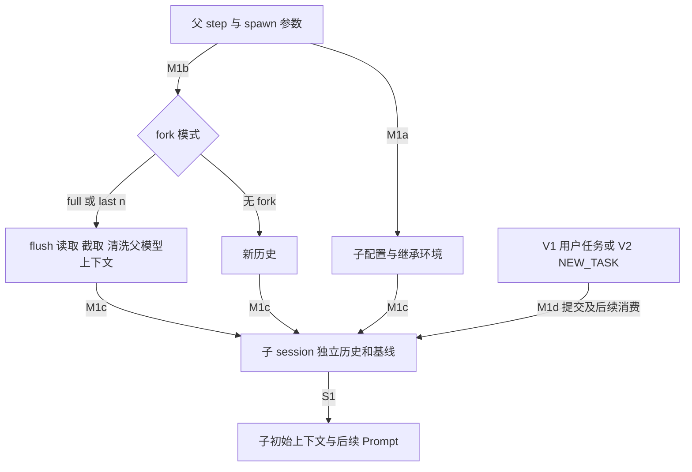

# M1–M4：子 Agent 的历史、配置、任务与模式

本组以当前 commit 的源码为事实基础，以 [逐问锚点](01-question-coverage.md) 和正式 B2 留存查询校对身份。下图是源码级控制/数据交接视图，不是编译器图；无共享 RA 查询、编译或运行验证。

## M1：FullHistory 是筛选后的继承；LastNTurns 需要重新建前缀

**结论。** 子线程拥有自己的 history。fork 先 flush 父 rollout，读取父模型上下文，再按模式截取、过滤、重写；不 fork 则 `InitialHistory::New` 启动，并独立生成初始上下文。

入口是 V1/V2 spawn handler 的 `SpawnAgentOptions.fork_mode`，出口是 child `InitialHistory::Forked` 或 New。[主分派](../../../codex/codex-rs/core/src/agent/control/spawn.rs:718) 将 fork/new 与继承环境、执行策略一起交给 ThreadManager。fork 要求 parent spawn call id、fork mode、ThreadSpawn source，否则返回 fatal；父 flush/read 失败传播：[fork 完整入口](../../../codex/codex-rs/core/src/agent/control/spawn.rs:917)。Legacy 读完整 stored history；Paginated 读 latest model context：[load_agent_model_context](../../../codex/codex-rs/core/src/agent/control/spawn.rs:159)。因此 `FullHistory` 在分页模式下指此接口取得的模型上下文，不意味着全部历史文件的每条记录。

| 内容 | Agent fork 的策略 |
|---|---|
| 顶层 Message | system/developer/user 保留；assistant 仅 FinalAnswer 保留；其他 role 丢弃。后续 history 还会过滤 system |
| 工具及其他模型条目 | 保留无 call id 的外部 FunctionCallOutput 和 ConfigurationUpdate；普通 call/result、reasoning、AgentMessage、AdditionalTools、compaction response item 等不保留 |
| durable Compacted | 保留 checkpoint，并专门清洗其中 replacement history；清 latest usage、guardian history，按 V2 建空 retained authorization scope |
| 独立 RetainedContext、SecurityRiskScore、TokenUsageRecord | 丢弃 |
| TurnContext / WorldState | FullHistory 可保留；LastNTurns 不保留。最新 legacy compaction 无 replacement 会使 FullHistory 也重建前缀 |
| developer 子片段 | 清 role/mode、旧 usage hint（V2）、time reminder/unavailable、guardian approval/denial；非空剩余片段才保留 |
| managed / persistent 指令 | 保留 baseline 时留；需重建时去掉，启动重新生成 |

表中顶层种类穷尽 match 见 [keep_forked_rollout_item](../../../codex/codex-rs/core/src/agent/control/spawn.rs:86)；片段过滤见 [retain_forked_developer_message](../../../codex/codex-rs/core/src/agent/control/spawn.rs:130)；checkpoint 内处理另见 [retain_mut](../../../codex/codex-rs/core/src/agent/control/spawn.rs:1119)。顶层 keep 策略不能直接套用到 replacement history：后者调用专门的片段清洗闭包，而没有逐项重复顶层 keep match。

[LastNTurns](../../../codex/codex-rs/core/src/thread_rollout_truncation.rs:266) 取末尾 n 个有效 fork-turn 的 suffix；n=0/无边界为空，少于 n 仍从第一个边界开始，丢启动前缀。[边界](../../../codex/codex-rs/core/src/thread_rollout_truncation.rs:79) 包括真实 user、trigger_turn communication 和 legacy assistant envelope，并处理 rollback；QueueOnly 消息不能单独算新任务回合。

V2 fork 将继承 user/assistant 标记 `inherited_user_message`。片段闭包会 take sender capture；**只有原先带 capture，或条目不是 user Message，才清 user_input_order**。无 capture 的 inherited user 可保留 order，不能写成全部清除。V2 有 subagent developer override 或 role 时，按父 developer 文本子串替换；需重建时删除旧子串，保留 baseline 时换成子版本；未匹配到且父已有 reference 时追加 override。源码有 provenance TODO，说明替换仍部分依赖文本匹配：[替换](../../../codex/codex-rs/core/src/agent/control/spawn.rs:1044)。V2 full fork 删除旧 usage-hint snapshot 并追加 child hint：[子提示](../../../codex/codex-rs/core/src/agent/control/spawn.rs:1203)。

普通 root fork 的 `fork_history_from_snapshot` 可补 interrupted boundary：[通用接口](../../../codex/codex-rs/core/src/thread_manager.rs:2599)。它与上述 Agent fork 过滤是不同步骤，不从同名 fork 推断同一语义。最终安装和 baseline/full-diff 分支见 [S11](S9-S12-budget-lifecycle.md)。

## M2：继承配置快照与共享 provider 是两件事

**结论。** 子配置从父 effective config 起步，再刷新调用 step 的模型/推理与当前 turn 的策略；子 history/usage 是独立状态。指令文本快照可继承，provider 仅在线程级且显式允许共享时继续共享。

[prepare_agent_spawn_config](../../../codex/codex-rs/core/src/agent/child_config.rs:51) 顺序是构建快照 → 请求/default 子模型与推理 override → 适用的 role → service tier → runtime policy 再刷新。V1 full fork 拒绝 agent_type override；V2 full fork 可指定 role。这里必须区分**提示说明与实现校验**：[usage guidance](../../../codex/codex-rs/prompts/src/multi_agent_instructions.rs:8) 告诉模型 full fork 不接受 model/effort override；但本次读到的 [V2 参数解析](../../../codex/codex-rs/core/src/tools/handlers/multi_agents_v2/spawn.rs:274) 与 shared config 并没有 full-fork 专属拒绝条件，后者仍调用 [override 校验](../../../codex/codex-rs/core/src/agent/child_config.rs:196)，验证模型可用性/effort 支持后赋值。所读路径存在说明与执行校验差异；不能把提示文字当成 handler 已强制执行，也没有在运行时验证这个组合。

| 对象 | 生产者/转换/子线程消费 |
|---|---|
| base instructions | [build_agent_spawn_config](../../../codex/codex-rs/core/src/agent/child_config.rs:109) 复制父 session 已生效文本与 provenance；resume config 清这两个 override，留给 rollout/session metadata 来源 |
| developer / token budget | [shared config](../../../codex/codex-rs/core/src/agent/child_config.rs:131) 用当前 turn developer，V2 可换 subagent developer；复制 configured token budget，避免冻结模型默认消息 |
| model/provider/reasoning | 捕获 step 模型、effective effort、summary；允许的请求/default/role 再覆盖并验证支持级别 |
| cwd/approval/profile | [runtime overrides](../../../codex/codex-rs/core/src/agent/child_config.rs:171) 从活跃 turn 覆盖，profile/approval 不合法报错；不靠旧 config clone 猜当前值 |
| 环境 | spawn tool 给 exact step `TurnEnvironmentSnapshot`；缺省只对 ThreadSpawn 从父 service snapshot 继承。[选择](../../../codex/codex-rs/core/src/agent/control/spawn.rs:678)、[fallback](../../../codex/codex-rs/core/src/agent/control.rs:578) |
| 执行策略 | ThreadSpawn 且 `child_uses_parent_exec_policy` 才共享父 ExecPolicyManager Arc；不适用时 None，子启动加载其策略。[条件](../../../codex/codex-rs/core/src/agent/control.rs:601) |
| 用户/线程指令 | [instructions_for_spawn](../../../codex/codex-rs/core/src/thread_manager.rs:1804) 对非 root 返回 inherited snapshots；[inherited_instructions](../../../codex/codex-rs/core/src/agents_md_manager.rs:150) 不传 user provider，仅传允许共享的 thread provider。冷 root resume 重新有 host user provider。 |
| repository AGENTS.md | 在子环境/信任选择下 refresh，与 inherited user/thread 文本合并；不是无条件永远使用父项目文件缓存。[S2](S2-S4-state-history.md) |
| hook | ThreadSpawn 对应 `SubagentStart`，附加文本 developer 记录到子历史；内部 SubAgent source 跳过普通启动 hook。[S6](S5-S8-producers.md) |
| usage | Agent fork 清 TokenUsageRecord/compacted latest record，但 **Legacy 可保留 TokenCount EventMsg，并恢复父 TokenUsageInfo**；Paginated 则额外过滤它。不能概括成父累计 usage 一律不继承。[M7](M5-M7-communication-budget.md) |

异步 spawn 的 [initial_input match](../../../codex/codex-rs/core/src/agent/control/spawn.rs:841) 两条路径成对携带 input 与通信 context。预约状态 commit/disarm 发生在**提交成功**后：V1 可取得 routing decision；V2 只等 [Submission 通道接收](../../../codex/codex-rs/core/src/session/mod.rs:962)，没有等待 mailbox handler/turn admission 回执。持久 graph edge 写失败只 warn，不能说 durable edge 必已成功；[PendingSpawn::drop](../../../codex/codex-rs/core/src/agent/control/spawn_guard.rs:44) 的清理另起异步任务。失败/取消/提交成功都不能直接证明 child task 已执行。

## M3：任务、角色提示、身份具有不同表示

V1 [handle_spawn_agent](../../../codex/codex-rs/core/src/tools/handlers/multi_agents/spawn.rs:71) 解析 text/items 为 `AgentInput::UserInput`，由子普通输入路径形成 user history。V2 [handler](../../../codex/codex-rs/core/src/tools/handlers/multi_agents_v2/spawn.rs:184) 形成 `AgentInput::Message` + TriggerTurn，[control API](../../../codex/codex-rs/core/src/agent/control/api.rs:70) 用 parent path 为 author、child canonical path 为 recipient，转 NEW_TASK communication。其最终模型条目与 mailbox 见 M6，不能把主 Agent 的 spawn 工具 JSON 原样当子 Prompt。

`AgentRoleConfig` 本身是声明（description/config_file/nickname 等）；[apply_role_to_config](../../../codex/codex-rs/core/src/agent/role.rs:69) 只从 role 文件提取允许的覆盖：developer、model、effort/summary/verbosity/personality/service tier，以及关闭部分功能/skills 的限制，不把整个 role TOML 任意覆盖父权限。[实际赋值](../../../codex/codex-rs/core/src/agent/role.rs:177)；仅 Personality::None 与非 None 状态切换、且原 base provenance=Model 时清 base 来源，启动重选，不是任意 personality 改变都清。[精确条件](../../../codex/codex-rs/core/src/agent/role.rs:224) role 文件读取/配置层失败会传播；role 后 effort 仅在值改变、存在 effort 且模型 metadata 非 fallback 等条件下校验，不能宣称任意 role model/effort 无效必在工具处拒绝。requested/default override 是另一条会查模型 whitelist 的路径。[role 校验分支](../../../codex/codex-rs/core/src/agent/child_config.rs:283)

`MultiAgentRoleInstructions` 是另一个类型，即模型可见的 usage guidance：[类型](../../../codex/codex-rs/prompts/src/multi_agent_instructions.rs:21)。Configured 原文无 catalog marker；Composed 加 shared/wait/concurrency/model override guidance，catalog override 才包 `<multi_agent_role>`；两种均为 **developer separate message**。role 文件的 developer 文本不等于这个 enum。

身份分层：canonical agent_path 出现在 V2 communication 的 author/recipient、token-budget 窗口片段的 Agent name，以及有界子 Agent 环境列表；nickname/role 在 spawn/wait/UI metadata 和 legacy completion 标注可见，但不因此证明每个子 Prompt 都包含全部 nickname/role/depth。[窗口身份](../../../codex/codex-rs/core/src/session/mod.rs:4435)、[子列表](../../../codex/codex-rs/core/src/session/world_state.rs:85)、[source 构建](../../../codex/codex-rs/core/src/tools/handlers/multi_agents_common.rs:133)。depth 用于 V1 工具/handler 准入条件，不能由结构字段宣称 depth 全时进入模型输入。

边证据：M1a [child config](../../../codex/codex-rs/core/src/agent/child_config.rs:51)；M1b [spawn match](../../../codex/codex-rs/core/src/agent/control/spawn.rs:718)；M1c [child fork](../../../codex/codex-rs/core/src/agent/control/spawn.rs:1228)/[new](../../../codex/codex-rs/core/src/agent/control/spawn.rs:747)；M1d [输入提交](../../../codex/codex-rs/core/src/agent/control/spawn.rs:849)。此图强调对象交接，未验证调度时间。

## M4：version 控制后端/工具，mode 控制行为说明

**结论。** Disabled/V1/V2 和 Custom/ExplicitRequestOnly/Proactive 不在同一层；mode 不是启用多 Agent 的开关。

[version config](../../../codex/codex-rs/core/src/config/mod.rs:1586) 优先显式 MultiAgentV2 feature、agents disabled；否则可取模型 version，再取 Collab feature 的 V1/Disabled。完整 spawn 入口先取 [config override](../../../codex/codex-rs/core/src/thread_manager.rs:1746)，显式 V2 可优先；之后的 history 解析子步骤先读 durable version，并在该子步骤内优先继承 Disabled。无 metadata 的老 resumed/forked 保持 V1：[resolve](../../../codex/codex-rs/core/src/session/mod.rs:484)。session 已选 version 时不会随每次模型自动重选 backend，只经配置约束返回：[model resolver](../../../codex/codex-rs/core/src/session/mod.rs:4244)。当前 V2 默认 max concurrency=4、wait=true、namespace=collaboration、in-memory board=false，均可配置：[默认](../../../codex/codex-rs/core/src/config/mod.rs:1350)，不能拿本次执行环境的 7 slots 倒推代码默认。

[effective_multi_agent_mode](../../../codex/codex-rs/core/src/session/multi_agents.rs:77) 仅为 V2 root/ThreadSpawn 产生：config hint 优先，其次模型 hint；无 hint 时 Ultra 用 proactive，其余 explicit；catalog 文本转 Custom。内部 session 无普通 mode。Custom 限 400 tokens；[diff](../../../codex/codex-rs/core/src/context/world_state/multi_agent_mode.rs:63) mode/hint-hash 均不变才省略；离开 Proactive 或旧状态 Unknown 时可显式补 ExplicitRequestOnly。这样“省略新 mode”不总等于没有行为更新。

[usage hint](../../../codex/codex-rs/core/src/session/multi_agents.rs:14) 分 root/subagent，配置空字符串可抑制 fallback。[usage state diff](../../../codex/codex-rs/core/src/context/world_state/multi_agent_usage_hint.rs:32) Known 同 hash/Unknown 不重复；Known 变化/Absent 发新 hint，必要包 usage marker。full context 在 usage 后放 mode，使模式说明在排列上靠后：[初始排序](../../../codex/codex-rs/core/src/session/mod.rs:4448)。这只是可见消息序列，不能证明模型必然遵守覆盖。

工具表由 [add_collaboration_tools](../../../codex/codex-rs/core/src/tools/spec_plan.rs:1299) 每次 plan 构建，V2 可选择 direct-only/namespace、message/followup/wait 暴露与 catalog 描述/schema；V1 可 deferred。Disabled 不注册；V1 深度限制；V2 有 agent_path 的 source 还要求模型支持 V2：[gate](../../../codex/codex-rs/core/src/tools/spec_plan.rs:672)。生成的 specs 随 S1 `Prompt.tools`（Lite 可能放 input）到模型，不是 mode 文字直接执行 spawn。

## 设计分析与边界

**源码事实：** 快照与 provider 分开、子 history 独立、fork 清父局部授权、version durable、mode/hint typed diff。

**解释推断：** 这些边界可减少子线程把父局部状态当本地状态，并保持冷恢复的工具协议一致；exact step snapshot 可避免创建子线程期间读到父后续变化。文本匹配 developer override 是 provenance 不完整情况下的折中。

**替代方案：** 为所有 instruction fragment 保存稳定 source id，可用身份替换而无需子串匹配；为 fork 提供显式保留策略对象可减少顶层/compacted 不同规则的阅读成本，但会更改持久化格式或兼容逻辑。

**待证：** 未运行 full/last-n、不同 role/model、并发变更/取消组合；未证明所有 source 的全部身份字段模型可见；没有把测试名当测试通过。本机渲染见图集，仍非 MIR/运行轨迹。没有新 LSP 请求。
