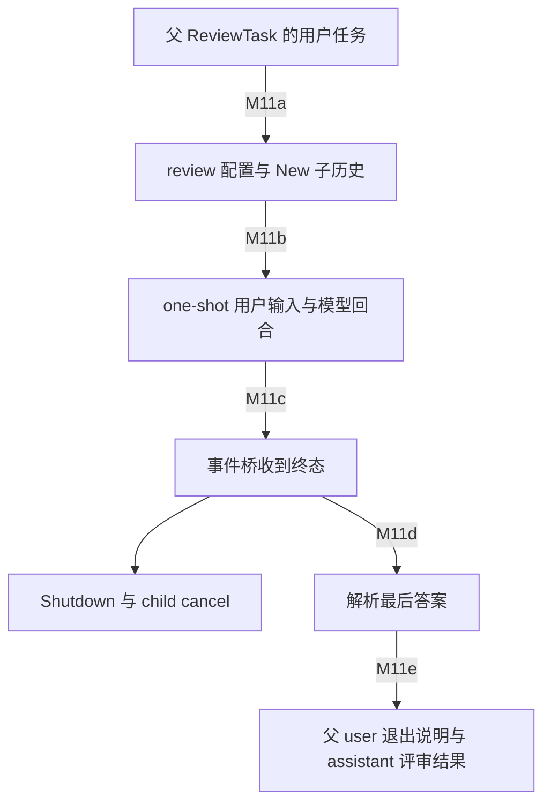

# M11：内部评审与一次性会话的 Context 接口

**结论。** 本 commit 的 inline `/review` 用 `codex_delegate::run_codex_thread_one_shot`；Guardian、记忆整理和压缩没有统一经过这个函数。不同任务共享部分 Session/ModelClient 类型，不等于共享同一上下文组织机制。以下只到接口层，不展开评审 rubric、审批流程或压缩算法。

源 commit/范围见 [输入核对](input-audit.json)，符号身份见 [M11 锚点](01-question-coverage.md)。本轮离线源码检索中该 one-shot 的生产调用者只有 `tasks/review.rs`，与既有 LSP 证据 L18–L24 的结论一致；不把“没有检索到其他调用”提升成动态覆盖证明。

## Inline `/review`：新历史、换 base、显式结果回填

入口 `ReviewTask::run` 只取 TurnInput 中的 UserInput，其他 input variants 不作为评审初始任务；调用 [start_review_conversation](../../../codex/codex-rs/core/src/tasks/review.rs:99)。它 clone 当前 config、禁 web search 与 Collab/MultiAgentV2、把 base 改为 `REVIEW_PROMPT` 且 provenance=Custom、approval Never，model 用 review_model 或当前模型。评审 turn 的 web-search/goals 等限制还有 [session::review](../../../codex/codex-rs/core/src/session/review.rs:31) 与工具 plan 的 gate；不单靠注释断言全部 view-image 入口已关。

[run_codex_thread_one_shot](../../../codex/codex-rs/core/src/codex_delegate.rs:189) 创建 child cancellation token、取 parent turn/env/root-turn attribution，通过 interactive delegate 建 session，随后 `TurnInputRequest::user_input` + StartIfIdle；未 Started 报错。当前调用传 `initial_history=None`，所以是 **New history**，没有隐式继承父对话。配置 clone 和历史继承必须分开看。

[interactive delegate](../../../codex/codex-rs/core/src/codex_delegate.rs:49) 验证 Never、限制 WS 能力继承父设置；继承用户/线程指令文本快照，**也保留显式 opt-in 的线程级 live provider**（用户级 provider 不传）：[inherited_instructions](../../../codex/codex-rs/core/src/agents_md_manager.rs:150)。另继承环境和 exec-policy Arc、auth/model manager/skills/plugin/MCP/image/thread-store 等服务；Inherit isolation 使用父 extensions，dynamic_tools 空；inherited multi-agent version Disabled。继承 extensions 不保证每个扩展内容都加入，因为仍有各扩展开关/source gate。parent trace disabled，不产生普通子 Agent result mailbox 通知。Guardian 的仅快照策略不能套到 inline review。

one-shot 桥接 bounded event channel，TurnComplete/TurnAborted 后发 Shutdown 并取消 child；对外 tx_sub 关闭，调用者不能再追加操作。[桥接与终止](../../../codex/codex-rs/core/src/codex_delegate.rs:245)。这条本地顺序由 loop/match 证明；不证明 shutdown 持久化已成功或所有并发 side-task 均结束。

结果从 [process_review_events](../../../codex/codex-rs/core/src/tasks/review.rs:145) 收最后 TurnComplete.last_agent_message，JSON→提取对象→plain-text fallback 解析为 `ReviewOutputEvent`；TurnAborted/channel close 返回 None。抑制所有 assistant completed-item 与内容 delta；legacy AgentMessage 缓冲最后一条，较早消息可向父转发。[exit_review_mode](../../../codex/codex-rs/core/src/tasks/review.rs:212) 将成功/中断说明作为 user message 写父 history，再发 ExitedReviewMode lifecycle，再记录 assistant review text。父取消时 run 不重复 exit，abort 有自己的出口。不是把 reviewer 整段工具历史合并到父 history。

边证据：M11a [配置](../../../codex/codex-rs/core/src/tasks/review.rs:105)；M11b [提交](../../../codex/codex-rs/core/src/codex_delegate.rs:223)；M11c [bridge](../../../codex/codex-rs/core/src/codex_delegate.rs:245)；M11d [解析](../../../codex/codex-rs/core/src/tasks/review.rs:167)；M11e [回填](../../../codex/codex-rs/core/src/tasks/review.rs:238)。人工源码视图，本机渲染见图集，仍非 MIR/运行轨迹。

## Detached review 是另一入口

[app-server delivery match](../../../codex/codex-rs/app-server/src/request_processors/turn_processor.rs:1568) 默认 Inline；Detached 构造 review-agent skill user prompt。[start_detached_review](../../../codex/codex-rs/app-server/src/request_processors/turn_processor.rs:1452) 拒绝 Paginated parent、clone config 并可改 review model，经 [AgentRunner::start](../../../codex/codex-rs/ext/agent/src/lib.rs:47) → [spawn_legacy_subagent](../../../codex/codex-rs/core/src/thread_manager.rs:1162) flush/read 父完整 history，fork interrupted snapshot，然后在新线程 StartIfIdle 输入任务。Detached 不调用 inline 的 one-shot/exit-review 回填链，而向客户端给新 thread/turn。不能拿 Inline New-history 结论概括 Detached full fork；也不能把这条 legacy generic fork 等同 M1 的清洗型 Agent fork。

## Guardian、Memories、Compaction 的接口对照

| 路径 | Context 组织、入口和出口 |
|---|---|
| Guardian reviewer | [生产 extension](../../../codex/codex-rs/ext/guardian-v2/src/sync_reviewer/mod.rs:82) 取 core `thread_options`，source=Internal(Guardian)、Paginated、Isolated，按需要只装 history tools/tool policy，通过 ThreadManager `start_thread_until`；cancel/history reset 控制生命周期。不是 one-shot delegate。 |
| Guardian 初始状态 | [thread_options](../../../codex/codex-rs/core/src/guardian/review_session_setup.rs:78) 用已提交 reviewer checkpoint 的选定 history，或 parent compaction 单条 seed，否则 New；指令使用 reuse key 捕获的 user/thread 文本，不保留 live provider；继承 parent auth/agent-control/runtime/env，history 不直接 clone 整段父 in-flight history。 |
| Guardian 配置与输入 | [extension reviewer config](../../../codex/codex-rs/ext/guardian-v2/src/sync_reviewer/reviewer_config.rs:12) 减 retries、清 developer/MCP/notify、关普通 memories/hooks/collab 等，并保留 managed constraints 的失败/警告语义；[core config](../../../codex/codex-rs/core/src/guardian/reviewer_config.rs:18) 换 policy/output-contract base、review model 与 live network。生产调用 [build_guardian_prompt_items_with_parent_turn](../../../codex/codex-rs/core/src/guardian/prompt.rs:82)（短名 helper 仅 cfg(test)），生成 evidence/context，Full/Delta progress 可复用；[PendingReviewContext 与 ReviewerTurn](../../../codex/codex-rs/core/src/guardian/review_session.rs:677) 把 context 与 items/env/profile/model/schema/parent response 交下游。[input_budget::finalize](../../../codex/codex-rs/core/src/guardian/input_budget.rs:81) 在实际采样输入上重新预算/替换可选 evidence，失败可返回错误；不能把构造完成当作已经进入模型 history。outcome 供审批消费，不是普通父聊天结果。 |
| Memory stage-one | [S8](S5-S8-producers.md)：phase1 建专用 Prompt（base + rollout extraction evidence + strict schema），独立 ModelClient session 流采样，不创建普通 one-shot Session。 |
| Memory consolidation | [S8](S5-S8-producers.md)：ThreadManager 建 Internal(MemoryConsolidation) thread、ephemeral 专用配置/用户整理任务；关闭继续读写记忆等回路，结果交记忆流水线。不是 `codex_delegate`。 |
| 本地 compaction | [本地入口](../../../codex/codex-rs/core/src/compact.rs:257) clone 当前 history，在临时副本加摘要任务，建 Prompt，session model client `new_session().stream`；[采样](../../../codex/codex-rs/core/src/compact.rs:747)。没有新 ThreadManager 子线程，最终替换当前 Session 历史；但 [非 PostTurn 输出](../../../codex/codex-rs/core/src/compact.rs:782) 在流中已写当前 history/rollout，PostTurn 才暂存到成功后替换。错误/取消不具有统一成功事务语义。 |
| remote v2 compaction / token-budget reset | remote provider 专用 compact 接口返回 replacement；token-budget reset 重建初始上下文无需摘要模型；回写接口见 [S11](S9-S12-budget-lifecycle.md)。不从 ModelClientSession 一词推出普通子会话。 |

这里的 `ModelClientSession` 是传输/重试状态会话，`Session` 是持有 history 的运行对象，`ThreadManager` 注册的 thread 是另一层实体；学习代码时应先识别对象层次再比较机制。

## 设计分析与待证

**源码事实：** inline review 使用新历史和结果摘要回填，Detached 使用父历史 fork，新 Guardian 有隔离/可复用 reviewer progress，memory 与 compaction 有各自专用采样接口。

**解释推断：** inline review 的 rubric/base 和输入边界可把临时评审任务与父对话分开；Guardian 只使用捕获指令而非 live provider，可减少评审动作期间来源漂移；reviewer checkpoint 复用与普通子 Agent mailbox 回答有不同责任。

**替代方案：** 统一 worker-session factory 可以复用生命周期实现，但若同时统一输入继承/结果回填策略会丢失当前差别；更合适的接口需显式暴露 history source、instruction snapshot、isolation、result sink。未证明这是维护者的设计意图。

**待证：** 未运行 review cancellation/JSON fallback/Detached、Guardian pool reuse/history reset，未验证审批结果或记忆存储产出；专用提示词与审批/记忆算法不在本问展开；无新 LSP 请求，未把图当编译器或运行时证据。
