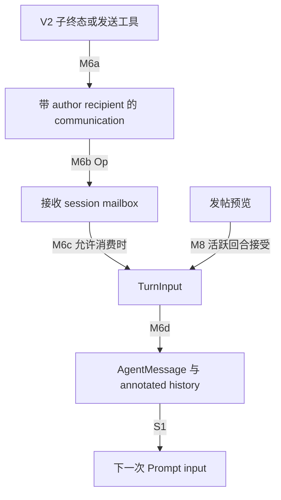

# M5–M7：结果返回、上下文隔离与预算所有权

这是源码级控制流/数据流分析；正式范围、锚点身份见 [覆盖清单](01-question-coverage.md)。本机渲染见 [图集](diagram-gallery.md)，没有运行验收。

## M5：终态通知和 wait 工具是不同通道

**结论。** V2 完成答案以非触发回合的 communication 发往父 mailbox，父下次允许消费输入时才进入历史；V1 通常注入 user-role notification。V1 wait 返回目标状态，V2 wait 只返回活动/超时说明。

V2 入口 [maybe_notify_parent_of_terminal_turn](../../../codex/codex-rs/core/src/session/mod.rs:2393) 限定 TurnComplete/TurnAborted + ThreadSpawn canonical path；terminal error 优先，只有 `is_final` 才交 controller。`AgentStatus` [映射](../../../codex/codex-rs/core/src/agent/status.rs:6) 将正常完成变 Completed，Interrupted/BudgetLimited abort 变 Interrupted；[is_final](../../../codex/codex-rs/core/src/agent/status.rs:26) 排除 PendingInit/Running/Interrupted。

[notify_parent_of_terminal_turn](../../../codex/codex-rs/core/src/agent/control/completion.rs:25) 从 child path 得 parent path，Completed 可另给 initiating thread 发 SubAgentActivity UI 事件；随后格式化结果并以 `trigger_turn=false` 投递父。投递失败只 debug，trace 在父接受提交后才记录；不是保证送达模型。Activity event 是观察事件，不是结果文本进入 history 的证据。

| 状态 | formatter 的结果 |
|---|---|
| Completed(Some) | 原答案文本进入 FINAL_ANSWER payload；本 formatter 没有统一成功答案截断 |
| Completed(None) | 空 payload 的 FINAL_ANSWER |
| Errored | 错误先按 900 tokens 截断，再加下一步提示；源码常量 1000−100 只用于这条错误分支 |
| Shutdown / NotFound | 固定状态文本 |
| PendingInit / Running / Interrupted | None，无此完成消息 |

穷尽 match 在 [format_inter_agent_completion_message](../../../codex/codex-rs/core/src/session_prefix.rs:19)，格式在 [InterAgentCompletionMessage](../../../codex/codex-rs/core/src/context/inter_agent_completion_message.rs:40)。因此不能根据常量名声称所有完成答案限 1000 tokens；最终 input 仍受其他 history/窗口机制约束。

V1 spawn 在成功后注册异步 [completion watcher](../../../codex/codex-rs/core/src/agent/control.rs:439)，订阅首个 final status，结束/订阅失败时查 status；通常 [inject_fragment_without_turn](../../../codex/codex-rs/core/src/codex_thread.rs:734) 写 [SubagentNotification](../../../codex/codex-rs/core/src/context/subagent_notification.rs:21)：user `<subagent_notification>` 内 agent reference/status JSON，不新建 user turn。watcher 还存在 canonical-path/V2 兼容分支，不能把所有 watcher 都叫 V1 user notification。

[V1 wait](../../../codex/codex-rs/core/src/tools/handlers/multi_agents/wait.rs:123) 订阅 targets 的 status，先交已 final 的结果，否则等首个 final 并收集立即就绪者，超时返回空 status/timed_out；FunctionToolOutput 可含 Completed 的答案。[V2 wait](../../../codex/codex-rs/core/src/tools/handlers/multi_agents_v2/wait.rs:67) 订阅 **input queue activity**，返回 Wait completed / interrupted by new input / timed out 及 timed_out。它不从子历史抓答案，答案仍由 mailbox 路径送达。参数越界、目标缺失、订阅失败有明确错误/NotFound 分支；外围工具执行取消见 S5。

## M6：每个 history 独立，跨线程必须通过对象交接

**结论。** Session 的 history 与 input queue 是线程局部；共享 AgentControl/服务 Arc 不等于共享 conversation history。父/其他 Agent 内容经过 fork snapshot、指令 provider、环境 snapshot、communication 或 board notice 才能进入接收模型。

[AgentMessage::into_communication](../../../codex/codex-rs/core/src/agent/control/delivery.rs:12) 区分 Plaintext/Encrypted：明文按 QueueOnly→MESSAGE、TriggerTurn→NEW_TASK 加 Task name/Sender/Payload；加密保持密文，没有本地解密成明文。`MessageDeliveryMode` [定义](../../../codex/codex-rs/core/src/agent/types.rs:57) 的唤醒语义不是消息 role。

[InterAgentCommunication::to_model_input_item](../../../codex/codex-rs/protocol/src/protocol.rs:883) 产生 **ResponseItem::AgentMessage**，带 author/recipient；Encrypted 时文字头 + EncryptedContent 两块。不要把 legacy `to_response_input_item` 的 assistant JSON envelope 与当前模型输入混为一谈；后者有另一 API 和序列化形态。[任务型 API](../../../codex/codex-rs/core/src/agent/control/api.rs:120) 不允许 followup 触发 root，QueueOnly 去 parent_turn attribution，目标 metadata/加载失败传播。

[提交](../../../codex/codex-rs/core/src/agent/control.rs:250) 通过 ThreadManager `send_op(Op::InterAgentCommunication)`，接收 [handler](../../../codex/codex-rs/core/src/session/handlers.rs:79) 先入 `VecDeque`，只有 trigger_turn 或 durable sleep 情况才尝试启动 pending-work 调度；普通 QueueOnly 不唤醒空闲任务。忙时在允许输入消费的采样边界 drain；已到 answer boundary 会 [defer next turn](../../../codex/codex-rs/core/src/session/input_queue.rs:275)，明确同回合输入/工具可重新打开。可投递≠已消费≠已发往模型，三个阶段各有接口。

[record_inter_agent_communication](../../../codex/codex-rs/core/src/session/mod.rs:3974) 把同一个 communication 转 item、准备媒体、获取 communication boundary semaphore、等待先前已确认的记录任务、分配 user_input_order、record annotated history，然后保存 trigger metadata + ResponseItem 并发 raw event。异步邮件的两端由相同 author/recipient/content 对象连接，证据不是仅靠 incoming call 关系。`drain_mailbox_input_items` 按队列序列转换为 TurnInput，并合成多封 TriggerTurn 的 start options：[队列](../../../codex/codex-rs/core/src/session/input_queue.rs:191)。这证明局部队列的顺序，不证明跨 task 全球运行顺序。

边证据：M6a [转换](../../../codex/codex-rs/core/src/agent/control/delivery.rs:12)/[完成](../../../codex/codex-rs/core/src/agent/control/completion.rs:98)；M6b [Op 提交](../../../codex/codex-rs/core/src/agent/control.rs:250)/[接收](../../../codex/codex-rs/core/src/session/handlers.rs:79)；M6c [drain](../../../codex/codex-rs/core/src/session/input_queue.rs:191)；M6d [记录](../../../codex/codex-rs/core/src/session/mod.rs:3974)；M8 [board host](../../../codex/codex-rs/core/src/agent_message_board.rs:159)。

此图只表示 V2/board communication；V1 idle 通知由 [inject_no_new_turn](../../../codex/codex-rs/core/src/session/inject.rs:170) 直接 record，不必先入图中的队列。

`<codex_delegation>` 是 **host 线程消息工具的另一通道**，可能作为无 call-id 的 FunctionCallOutput 注入；不能把任何同样的文本包装自动认定为可信授权。[capture_sender_user_messages](../../../codex/codex-rs/core/src/agent/control/sender_context.rs:16) 仅在 admission 识别已分配 id、特定 namespace/name 的 host-delivered output，严格解析 source_thread_id，取源 retained context 最近三个 **local user 条目**；complete 提供文本，不完整仍占一个 None 槽位，继承/assistant/verified answer 排除。单条渲染超过 900 bytes 或不完整都成为缺失证据提示：[渲染](../../../codex/codex-rs/core/src/context/guardian_sender_messages.rs:35)。无可用来源仍建空 snapshot。

捕获结果保存为 envelope 的 `CodexHarnessMetadata.sender_user_messages`：[admission](../../../codex/codex-rs/core/src/session/turn_input.rs:752)、[retained 写入](../../../codex/codex-rs/core/src/context_manager/history.rs:561)。[SenderUserMessages](../../../codex/codex-rs/history/src/sender_user_messages.rs:18) 最多 3600 bytes，超限变证据缺失提示。读取者是 [Guardian shared section](../../../codex/codex-rs/guardian-context/src/sender_user_messages.rs:18)。**发送者的这组捕获用户消息不作为普通接收 Agent input 追加；它作为 reviewer-only metadata 供 Guardian 消费。** 被投递的任务 payload 本身仍可在主模型看到，必须区分两者。

其他通道：fork 见 M1；provider 见 M9；环境及子列表见 S3/M2；board 见 M8。对 source metadata、observer/UI event、authorization sidecar、模型 input 分层，不凭 struct 声明认定全都进入 Prompt。

## M7：rollout budget 在树上共享，窗口用量在线程内计算

**结论。** 不存在把 root 的 context-window token 余额按子 Agent 固定切份的这一实现。共享的 rollout 加权累计器与各线程自己的 history/window 状态并存。

[LocalAgentRuntime](../../../codex/codex-rs/core/src/agent/control/runtime.rs:23) 持有 `Arc<RolloutBudget>`，cloned controller/子 spawn 共享同一 runtime；M2 spawn 明确传 `self.clone()`。根配置在 runtime 初始化 configure 一次：[初始化](../../../codex/codex-rs/core/src/agent/control/runtime.rs:43)。[record_rollout_budget_usage](../../../codex/codex-rs/core/src/agent/control/budget.rs:12) 返回 exhausted 时变 `SessionBudgetExceeded`，上游停止/错误路径处理，不能只把它当 UI 提醒。

生产者是各模型 Completed usage（含相邻 remote compaction usage 接口），转换权重见 [S10](S9-S12-budget-lifecycle.md)，存储是预算 Mutex 内总 weighted_used。消费者除 exhausted 判定外，还有 per-thread/window reminder map：[RolloutBudget](../../../codex/codex-rs/core/src/rollout_budget.rs:69)。跨过更多阈值或换窗口才需要新提醒；首次 index=0 也可提示初始预算。当前线程采样前 [maybe_record_reminder](../../../codex/codex-rs/core/src/session/turn.rs:454) 将 developer budget fragment 写 history 后 mark delivered，因此不同 Agent 会在自己下一次检查时收到对应共享余额，不是同时广播。

token budget、active context tokens、window baseline/id 在各自 Session history/window 内计算；`TokenBudgetContext` 带 agent_path/window ids：[S9/S10](S9-S12-budget-lifecycle.md)。需要区分两种 usage： [TokenUsageRecord](../../../codex/codex-rs/core/src/agent/control/spawn.rs:124) 与 [Compacted latest record](../../../codex/codex-rs/core/src/agent/control/spawn.rs:1142) 被清；**TokenCount 的 TokenUsageInfo 在 Legacy fork 可保留**，仅 [Paginated 额外过滤](../../../codex/codex-rs/core/src/agent/control/spawn.rs:1119)。[Forked 初始安装](../../../codex/codex-rs/core/src/session/mod.rs:1628) 恢复该 info，后续 [update_token_info](../../../codex/codex-rs/core/src/context_manager/history.rs:851) 继续 new_or_append。因此不能说所有父累计 usage 都不继承；继承输入仍有本地估算成本，独立 history/window 不等于 usage 初值必为零。

## 设计分析与待证

**源码事实：** mailbox admission/consumption 分离，任务与普通消息有唤醒位，结果文本/工具输出/UI 事件分开，sender authorization sidecar 只给 reviewer，共享预算 Arc 与局部窗口并存。

**解释推断：** 不唤醒 idle 的结果消息可以避免自动形成额外回合；answer boundary 的延后保护刚完成答案。sidecar provenance 和 inherited 标记降低子任务将转述误认本地用户授权的机会。共享累计器约束整体成本，同时局部窗口负责模型容量。

**替代方案：** 对 message 提供 durable queued/consumed/sampled receipt 可改善可观测性，但必须明确每种 receipt 的意义与持久化成本；固定子预算分配可控制任务份额，但也会降低空闲预算在树内复用的灵活性。源码没有证明维护者意图。

**待证：** 未动态测试终态竞态、投递失败、answer-boundary 重开、budget exhaustion 与取消；本地 encrypted 数据流只能证明传递，不能证明服务端解密；未把当前执行平台 collaboration tools 的行为套回仓库版本。无需新 LSP 查询。
