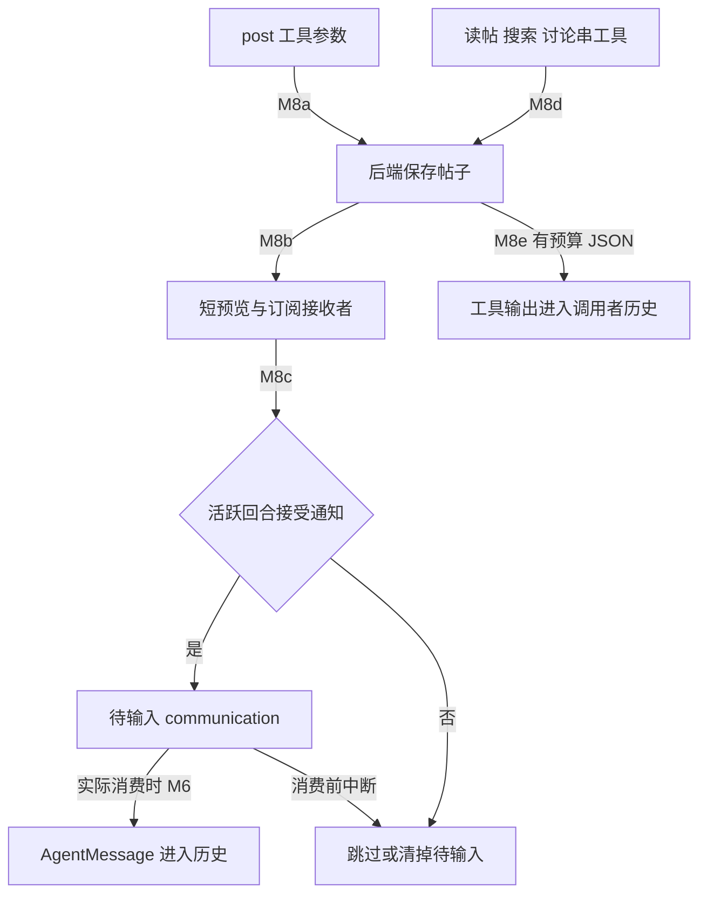

# M8–M10：消息板、共享指令与冷恢复

正式范围与符号锚点见 [覆盖清单](01-question-coverage.md)。下面用字段构造、存储与消费两端说明数据流，不把 call graph 当数据流；没有查询共享 RA 或运行测试。

## M8：推送是活跃回合的短预览，拉取是有预算的工具输出

**结论。** 发帖成功、通知 Accepted、模型已看到帖子是三种不同状态。帖子保存在 board 后端，推送只尝试活跃且仍接受 mailbox 的回合；空闲/答案边界不保留此推送为未来 mailbox，但帖子可拉取。

[install_agent_message_board](../../../codex/codex-rs/core/src/agent_message_board.rs:35) 只在 AgentMessageBoard 与显式 MultiAgentV2 feature 都开时提供 binding；ephemeral 且未选 in_memory 时不打开 durable storage。in_memory=true 用共享 `InMemoryMessageBoards` 按 tree/session 选择内存 board，否则开本地 SQLite。[on_thread_start](../../../codex/codex-rs/ext/agent-message-board/src/extension.rs:47) 核对 tree identity 后保存 board/caller/path/namespace 的 thread-local Binding；初始化错误警告并不提供工具。安装本身不建 board，恢复启动会再次执行 factory。

**推送链。** `post` 工具验证唯一 destination、解析接收者相对路径，给 request id 加 turn/call（code-mode 加 cell/runtime id）：[工具入口](../../../codex/codex-rs/ext/agent-message-board/src/tools.rs:343)。后端合并订阅者/显式接收者，排除作者本人；写入成功后生成 150 字符 PostPreview、并发限 16 best-effort notify。[SQLite commit 后通知](../../../codex/codex-rs/ext/agent-message-board/src/local.rs:261)、[内存路径](../../../codex/codex-rs/ext/agent-message-board/src/in_memory.rs:274)。通知错误只 warn，不回滚已存帖子。

[LocalBoardHost::notify](../../../codex/codex-rs/core/src/agent_message_board.rs:159) 检查 manager/loaded thread/tree/path；构造 author=帖作者、recipient=接收 path、trigger_turn=false 的 communication，调用 [deliver_mailbox_communication_to_current_turn](../../../codex/codex-rs/core/src/session/input_queue.rs:142)。必须有 active task 且接受当前回合 mailbox 才入 pending input，返回 Accepted；缺线程、空闲、已 defer 等为 SkippedInactive，其他错误传播。**这里不同于 M5 普通完成通知的 VecDeque 长期排队路径。**

[AgentMessageBoardNotification](../../../codex/codex-rs/core/src/context/agent_message_board_notification.rs:26) 渲染 CHANNEL_POST、Sender、Channel、Message ID、Thread ID、Payload；预览有 truncated 则提示 read_post。fragment 声明 assistant role，但实际交接转换为 `ResponseItem::AgentMessage`，并由 M6 记录 history。发送者自身由 recipients.remove 排除，仍通过 post 的工具结果得到 PostMetadata。

**取消与重试。** [SQLite post](../../../codex/codex-rs/ext/agent-message-board/src/local.rs:174) 与 [内存 post](../../../codex/codex-rs/ext/agent-message-board/src/in_memory.rs:219) 均另起 Tokio task 执行 post_inner；外层等待取消不能保证未写帖，已启动的写入/一次 fanout 可继续。相同 request id 与内容的重试直接返回既有 metadata，不补发通知；内容不同则拒绝复用。Accepted 之后，[get_pending_input](../../../codex/codex-rs/core/src/session/input_queue.rs:353) 取 turn-local pending，才由 [回合消费](../../../codex/codex-rs/core/src/session/turn.rs:432) 与 [record_pending_input](../../../codex/codex-rs/core/src/hook_runtime.rs:766) 记录 communication。中断出口 [clear_pending](../../../codex/codex-rs/core/src/tasks/mod.rs:536) 可能在消费前清掉它；[正常结束](../../../codex/codex-rs/core/src/tasks/mod.rs:629) 可记录到 history，却未再采样。进程退出/数据库错误仍没有运行保证。

**拉取链。** get_channels/list_threads/search_posts/read_thread/read_post 调同一个 `AgentMessageBoard` trait，返回 JSON metadata/预览或 offset 字符片段。[完整工具分支](../../../codex/codex-rs/ext/agent-message-board/src/tools.rs:168)、[read_post](../../../codex/codex-rs/ext/agent-message-board/src/tools.rs:288)。page 最多50、preview/read最多20000字符；response byte budget 不够时 [bounded_read](../../../codex/codex-rs/ext/agent-message-board/src/tools.rs:410) 逐次减小 limit，仍装不下 metadata 就 RespondToModel error。返回 [JsonToolOutput.with_external_context](../../../codex/codex-rs/ext/agent-message-board/src/tools.rs:121)，随后按 S5 的 call/result 链进入历史。post/subscribe 本身返回 metadata/state，不等于回显所有讨论正文。

边证据：M8a [工具](../../../codex/codex-rs/ext/agent-message-board/src/tools.rs:343)/[存储](../../../codex/codex-rs/ext/agent-message-board/src/local.rs:287)；M8b [通知](../../../codex/codex-rs/ext/agent-message-board/src/local.rs:298)；M8c [host](../../../codex/codex-rs/core/src/agent_message_board.rs:159)；M8d/e [读取和输出](../../../codex/codex-rs/ext/agent-message-board/src/tools.rs:121)。

**远程接口边界。** [RemoteAgentMessageBoard impl](../../../codex/codex-rs/agent-message-board-client/src/client.rs:316) 实现同类 create/list/post/search/read/subscription 接口；[call](../../../codex/codex-rs/agent-message-board-client/src/client.rs:270) 序列化 caller/timestamp/operation，经 bearer HTTP POST `/call`，限制 body、30s超时并解码失败。notification SSE 有 ready handshake，检查 recipient/turn 与150字符预览：[接口](../../../codex/codex-rs/agent-message-board-client/src/client.rs:240)。本 commit 的 core factory 只建 local/in-memory；结合 M8 已验收 LSP L16 和仓库引用检索，没有将远程客户端冒称生产 runtime 已接入。远程服务内部算法与部署不展开。

## M9：共享的是可替换 provider 包装，后代按 step 读取

**结论。** 显式 `share_with_subagents` 的线程级 provider 以 Arc 包装共享；用户级 provider 不共享。root 释放也不必立即结束 provider，树 runtime 保留它；manager 只存 Weak 索引，树引用结束后可回收。

[SharedThreadInstructionsProviders::for_root](../../../codex/codex-rs/core/src/thread_manager/shared_instructions.rs:19) 清无 strong reference 的 root entry；已有包装且新的 provider 可共享时替换内部指针；新 opt-in provider 建 Arc，索引为 Weak。传 None 不覆盖 existing provider。替换成 **不共享** provider 时，旧 wrapper.provider=None，新 root 直接用新 provider。

[load_thread_instructions](../../../codex/codex-rs/core/src/thread_manager/shared_instructions.rs:82) clone provider 后放锁 await，只有 await 返回时指针仍是当前 provider 才更新 last；provider=None 返回这个缓存。**last 是最近当前 provider load 返回的原始 instructions，可为 None，并非最后已应用快照**：缓存写入先于下游 [normalize/大小验证、项目加载与状态提交](../../../codex/codex-rs/core/src/agents_md_manager.rs:113)。因此“不共享替换”后的新 load 不读 root-private provider，而复用该原始缓存，仍可能被下游拒绝；从未成功 load 时 last 可为 None。替换前已经发出的 load 仍返回其捕获 provider 的结果，pointer 检查不保证在途读取立即一致。[runtime root binding](../../../codex/codex-rs/core/src/agent/control/runtime.rs:111) 用 OnceLock 保留 wrapper；[inherited_instructions](../../../codex/codex-rs/core/src/agents_md_manager.rs:150) 仅继承 opt-in thread provider 与用户/线程文本快照。

后代在 [capture step](../../../codex/codex-rs/core/src/session/mod.rs:3940) 等待 `AgentsMdManager::refresh`。[refresh](../../../codex/codex-rs/core/src/agents_md_manager.rs:65) semaphore 序列化重叠捕获；每次加载 host provider，验证线程大小，host 未变可复用 cache，host 变时重合并，环境/信任变时清 repository cache 再读取。不是共享变量变化立即推送所有子历史。

加载结果变成 world-state AgentsMd section；[render_diff](../../../codex/codex-rs/core/src/context/world_state/agents_md.rs:52) 相同 snapshot 省略，有旧内容时加替换提示，无新内容但旧可能有则发移除提示；都是 `UserInstructions` user-role 包装。快照 user/thread/repository 的合并次序见 S2。加载失败/超限保留错误，未声明新 provider 已生效；刷新取消与并发替换不等于原子广播。

## M10：先恢复身份索引，子历史按需载入

**结论。** 冷 root V2 resume 不马上启动所有子 Agent。它先从 graph/store 恢复 path/role/nickname 索引，再在 send/ensure_child 时加载所需 child 的 history；恢复后的新 step 按当前配置/环境生成差量或 full context。

入口 [ThreadManager spawn/resume](../../../codex/codex-rs/core/src/thread_manager.rs:2177) 限定 resumed root V2 + local control；[restore_v2_agent_metadata](../../../codex/codex-rs/core/src/agent/control/spawn.rs:188) 注册 root，读 open descendants；最多8个存储读重叠，但 buffered 输出按 graph order reserve path/nickname。读取不含 history，从 stored path/role/nickname 优先、source fallback 构造 metadata；错误 warn，不能宣称所有 descendants 保证恢复。这里的顺序证据来自 buffered 消费和 reserve 循环，不来自 call graph。

[ensure_multi_agent_v2_child_loaded](../../../codex/codex-rs/core/src/thread_manager.rs:1227) 验证 stored parent 并要求 parent loaded；底层 [ensure_v2_agent_loaded](../../../codex/codex-rs/core/src/agent/control/spawn.rs:312) 再检查 live parent ownership/running/version/shared registry、child metadata、history 的 durable V2 source 和 parent 一致。Legacy 完整读、Paginated latest context scan 见 M1/S11；已载入可 touch residency 返回。

恢复配置：用当前 parent runtime 构 resume config（base override 清除），读 stored model/provider/effort；重用 role 限制后恢复当前 runtime approval/profile/cwd；stored model 最后覆盖，缺 provider 报错。[角色与模型顺序](../../../codex/codex-rs/core/src/agent/control/spawn.rs:410)。缓存 environment 必须匹配当前 parent ready environment；本地权限变化可取交集，remote权限变化拒绝。[环境边界](../../../codex/codex-rs/core/src/agent/control/spawn.rs:477)。指令先捕获，避免 residency reserve 驱逐 parent 后丢来源；没有 live parent 时可取树保存的 shared provider：[reload 交接](../../../codex/codex-rs/core/src/agent/control/spawn.rs:570)。

出口 [resume_thread_with_history_with_source](../../../codex/codex-rs/core/src/agent/control/spawn.rs:591) → S11 重建安装 history/reference/world-state/window，随后 commit residency。并发另一次加载已成功时，错误分支可核验现存线程后返回，不重复声明两个 history 被合并。

恢复后的首次 step 重新加载 AGENTS/共享 provider、环境/tools、模型消息；world-state 有有效 baseline 时 diff，没有 baseline/老 checkpoint 时 full。M4 的 hint hash/mode diff 可以刷新 legacy usage hint 或从 proactive 回到 explicit；恢复 status metadata 本身不代表模式已显示。变更进入模型仍需后续 Prompt 采样。

消息板订阅不在 Prompt/history baseline 内：SQLite [set_subscription](../../../codex/codex-rs/ext/agent-message-board/src/local.rs:312) 保存 subscriptions + explicit opt-outs，后续参与 [subscribe](../../../codex/codex-rs/ext/agent-message-board/src/local.rs:413) 不覆盖 opt-out；恢复同 tree board 能继续查询。内存 registry 存 **Weak**，只有至少一个 [board runtime handle 强引用](../../../codex/codex-rs/ext/agent-message-board/src/in_memory.rs:40) 存活才可复用；最后 handle 释放后，即使 registry 仍活，同进程 reopen 也新建空 board。不能承诺跨进程冷启动持久化。恢复不会补发过去被 SkippedInactive 的推送；拉取仍能查持久帖子。

## 设计分析与待证

**源码事实：** board 存储/推送分离，通知只给当前回合；共享 provider 有 weak index/strong tree lifetime 与 pointer 校验；恢复 metadata 与 history 分段且按需加载。

**解释推断：** 短通知降低输入成本，读帖提供按需补正文；显式 opt-out 避免发帖导致意外重订阅；身份先恢复、history 后载入可减少冷启动负担，权限交集检查防止旧 child 继续使用已变更的执行权。

**替代方案：** durable notification cursor/补投可提高通知可靠性，但会改变当前“只投活跃回合”的行为与历史重复成本；共享指令加 generation 与应用回执可更明确显示后代何时生效，但需跨 task 协议。

**待证：** 未运行 SQLite/内存场景、SSE跨进程、冷恢复 graph 顺序/失败、并发 provider 更新；不验证远程服务 runtime；本机渲染见图集，仍非 MIR/运行轨迹。现有源码和 LSP 留存足以说明本问接口，无新增共享 RA 查询需求。
