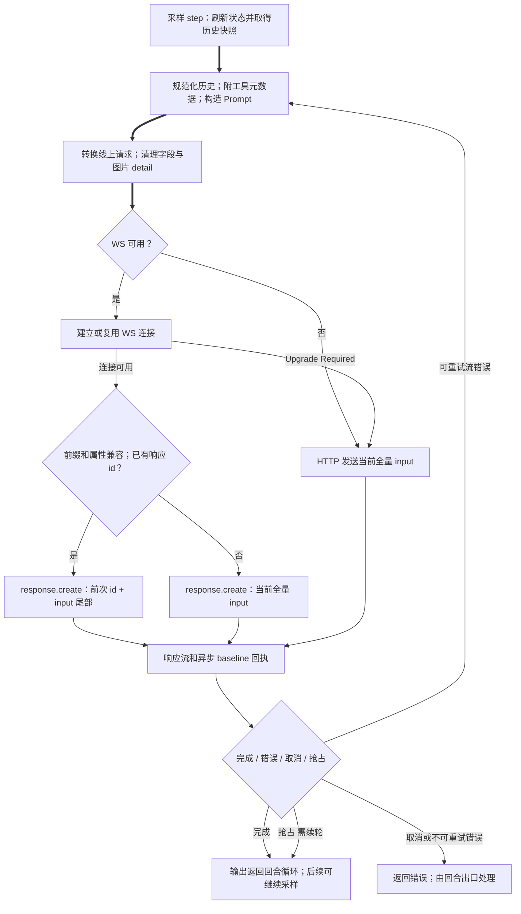
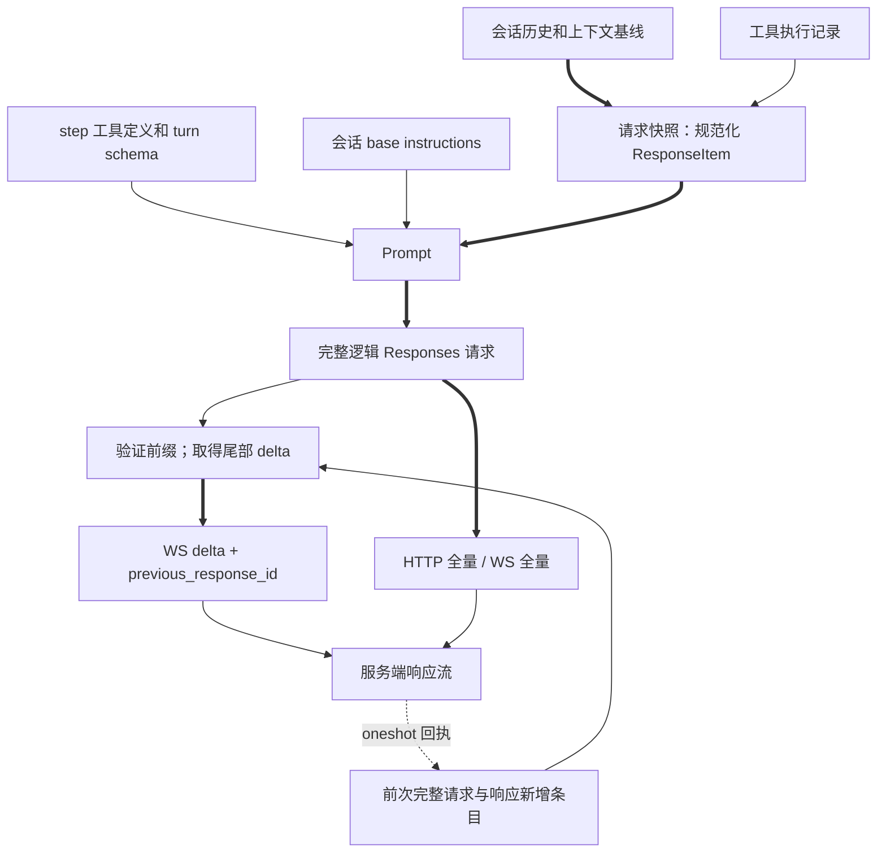

# S1 一次模型请求如何组装并发出

**结论（源码事实）**：请求没有一个永远重建的“总提示词字符串”。会话持有历史；每个推理 step 取得快照并规范化，附加执行工具元数据，构造 `Prompt`；传输层再把它转换为 Responses 请求。HTTP 发送当前逻辑 input 全量；WebSocket 只有在上次完整请求、服务端输出与当前前缀兼容时才发送增量。这里的“全量”指经过过滤/规范化后的当前历史，不指全部原始 rollout。

## 入口、顺序与对象

入口为 `codex_core::session::turn::run_turn`。第一次 step 先捕获模型、环境和工具，再等待上下文更新写入；随后 skills/plugins 计算、SessionStart hooks、用户提交 hooks 与输入写入，再记录 skills/plugins injection。推理循环依次写时间提醒、step world state 差异、推理强度 override，最后 `clone_history().for_prompt(...)`。这些是此函数的源码路径顺序，不能扩展为所有后台任务的全局顺序。[入口](../../../codex/codex-rs/core/src/session/turn.rs:260)、[hooks/输入](../../../codex/codex-rs/core/src/session/turn.rs:369)、[采样前](../../../codex/codex-rs/core/src/session/turn.rs:500)

初始上下文的 push 顺序由 `Session::build_initial_context_with_world_state` 决定：合并 developer bundle → separate developer sections（预算窗口、角色等）→ 单独 mode developer 消息 → 合并 contextual user 消息 → Guardian 专用 policy（仅该分支）→ managed developer instructions。模型切换片段在 developer bundle 头部。空内容可以不产生消息。`Prompt.base_instructions` 不在这个序列内；它直到传输层决定放在 `instructions` 字段或 responses-lite 的 developer 前缀。[完整构造](../../../codex/codex-rs/core/src/session/mod.rs:4301)、[合并消息](../../../codex/codex-rs/core/src/context_manager/updates.rs:12)

| 数据 | 生产/转换 | 保存与消费者 |
|---|---|---|
| 历史 `ResponseItemEnvelope` | 输入、模型输出、工具结果、context updates 等写入 ContextManager；`for_prompt` 消费快照，补缺失工具输出、去孤立输出、移除不支持的媒体，剥 envelope | 会话状态长期持有；本次请求得到新的 `Vec<ResponseItem>`，规范化不等于直接重写原历史 |
| 执行工具 metadata | `ExecutedToolCalls::attach_to_prompt` 根据 retained tool results 与 output index 附到本次 input | prompt 副本及执行记录器；后续 wire 限额还可裁去元数据并使 inventory 失效 |
| `base_instructions` | `Session::get_prompt_base_instructions` 读取会话保存状态；采样重试循环外取得 | `Prompt` 字段；常规请求 `instructions`，lite 变 developer message |
| tools | 当前 step 的 `ToolRouter::model_visible_specs()` | `Arc<[ToolSpec]>`；常规 `tools` 字段，lite 的 `AdditionalTools` 前缀 |
| output schema / strict / access program | turn schema 的 clone；Guardian 决定 strict；turn access program | 请求 text 参数与 auth 决定的 access programs |
| request model / reasoning / tier / metadata | 当前 model info、采样参数、provider/auth、response metadata 与 request contributors | `ResponsesApiRequest` → HTTP 或 `ResponseCreateWsRequest` |

证据：[Prompt 定义](../../../codex/codex-rs/core/src/client_common.rs:23)、[规范化](../../../codex/codex-rs/core/src/context_manager/history.rs:581)、[规范化分支](../../../codex/codex-rs/core/src/context_manager/history.rs:933)、[attach](../../../codex/codex-rs/core/src/tools/executed_tool_calls/request_metadata.rs:29)、[build_prompt](../../../codex/codex-rs/core/src/session/turn.rs:1583)。

## 线上转换与传输

`ModelClient::build_responses_request` 先 clone input 并规范化图片 detail：lite 清空 detail；普通模型不支持 Original 时退到默认值。模型不支持/未启用 reasoning override 时过滤 `ConfigurationUpdate`，只改请求副本。常规 Responses 用 `instructions` + `tools`；lite 在 input 头插入 AdditionalTools，再插非空 base instructions，顶层 instructions 空、tools None，并用线程命名空间及可见字节 hash 稳定生成 id。非 OpenAI 清内部 chat metadata 和 encrypted function args。`include_internal=false` 清工具 metadata。后续传输准备还清非 prefixed id、按 feature 清 content item kinds，增加 auth/路由/Guardian/request contributors 元数据，再做 tool metadata bounded input。[请求完整构造](../../../codex/codex-rs/core/src/client.rs:885)、[图片](../../../codex/codex-rs/core/src/client_common.rs:111)、[请求条目准备](../../../codex/codex-rs/core/src/client.rs:1010)

`ModelClientSession::stream` 由 provider 能力与 session fallback 状态选择 WS，否则 HTTP。HTTP 在 `stream_responses_api` 中构造当前完整请求，记录 started 后交 `ApiResponsesClient::stream_request`。WS 的 baseline 是 **last_request.input + last_response.items_added**；必须有 last_response、非空 response id、所列复用属性一致、当前 input 长度足够、前缀相等，才得到尾部 delta。[属性比较](../../../codex/codex-rs/core/src/client.rs:337) 不比较 stream_options/client_metadata/access_programs；[前缀比较](../../../codex/codex-rs/core/src/client.rs:394) 只允许忽略 internal_chat_message_metadata_passthrough，工具结果 metadata 不同仍拒绝。否则发送全量并没有 previous_response_id。[入口](../../../codex/codex-rs/core/src/client.rs:2218)、[HTTP](../../../codex/codex-rs/core/src/client.rs:1645)、[增量条件](../../../codex/codex-rs/core/src/client.rs:1384)、[WS payload](../../../codex/codex-rs/core/src/client.rs:1994)

响应 mapper 通过 oneshot 把上次 response id 和新增 output 交回此 client session；`get_last_response` 用 `try_recv`，Empty/Closed 直接没有 continuation。这个异步交接说明“存在缓存字段”不等于这次一定能增量。WS prewarm 使用 generate=false，消费到 Completed 或流耗尽；流耗尽也可返回 Ok，但不证明 continuation 已建立；它不记普通 inference trace。复用未追踪 prewarm response id 时，trace 特别记逻辑全量请求；普通 WS 则记实际 response.create payload。[接收](../../../codex/codex-rs/core/src/client.rs:1419)、[trace 特例](../../../codex/codex-rs/core/src/client.rs:1977)、[prewarm](../../../codex/codex-rs/core/src/client.rs:2150)

## 控制流图（源码视图）

图边映射：A→B 为 `turn.rs:500–530 / 1650–1665`；B→C 为 build_prompt 与 ModelClientSession::stream；D 为 `client.rs:2230–2260`；W 的连接/fallback 为 `1906–1939`；E/F/G 为 `1384–1448 / 1994–2053`；I 为 `2085–2107 / 1419–1426`；J 与重试为 `turn.rs:1681–1746`。连接成功才进入 continuation 判断；这里的 Upgrade Required fallback 发生在发送 response.create 之前。

## 数据流图（源码视图）

数据边依据实际字段构造/读写，主要同上对象表；没有依据调用图臆造输入内容。跨 crate 边界为 core → codex-api 的 Responses 请求与响应流，模型服务内如何解释 prefix/previous_response_id 是接口约定，此任务未测。

## 错误、取消与恢复

构造工具 JSON/请求可失败并向上传播。HTTP/WS 可恢复 auth 错误在内部循环重新取 client setup；WS 连接 Upgrade Required 返回显式 fallback；其他连接/流错误向上传播。采样层 ContextWindowExceeded 标 token full 并立即返回；UsageLimitReached 更新 rate limits 并返回；其余流错误交重试策略，必要时转 HTTP。retry 等待可被 preempt 或 cancellation 中断，用户取消为 TurnAborted，抢占返回 needs_follow_up。恢复历史或失去 continuation、字段/前缀改变均不能假定 delta，会退到全量条件判断。[采样全部分支](../../../codex/codex-rs/core/src/session/turn.rs:1612)、[HTTP auth](../../../codex/codex-rs/core/src/client.rs:1766)、[WS auth/fallback](../../../codex/codex-rs/core/src/client.rs:1906)

## 互证与设计分析

保存 LSP 锚点 E4 的 identity：`codex_core::session::turn::build_prompt`，`cand_key=803b0fda35e56a2a7f347cbdcc2b778a`；[q/h0_E4.json](../raw/context_fixedP_full1721_scope_20261005/B1/q/h0_E4.json) 的 references/outgoing 与源码 `turn.rs:1661` 构造互证。其字段含义以完整结构体字面量判读，不以调用边判断。独立复核从出口倒读 WS payload 与 HTTP stream_request，确认都由 build_responses_request 的副本进入，WS 尾部确实来自 input 切片。未运行相关测试；保存测试/快照可提示场景，不能证明本轮实际发包。

**解释推断**：长期历史、step 快照与 wire 副本分层，便于按不同模型/传输适配而保留可恢复原数据；stable prefix ids 与严格 continuation 判断体现缓存身份一致性的取舍。这解释与源码注释一致，但不是开发者访谈证明的动机。

**替代方案**：永远全量发送可简化 continuation 状态，但减少 WS 增量收益；直接改会话历史可省副本，却让模型切换、恢复与审计更难分辨原始内容和 wire 清理。成本收益需实际测量。

**待证**：服务端实际缓存命中、真实网络 payload、并发 arrival 的具体顺序、其他平台/provider 的执行结果；本机渲染见图集，仍非 MIR/运行轨迹。S1 的源码链路已交付，运行时层级未验证。
