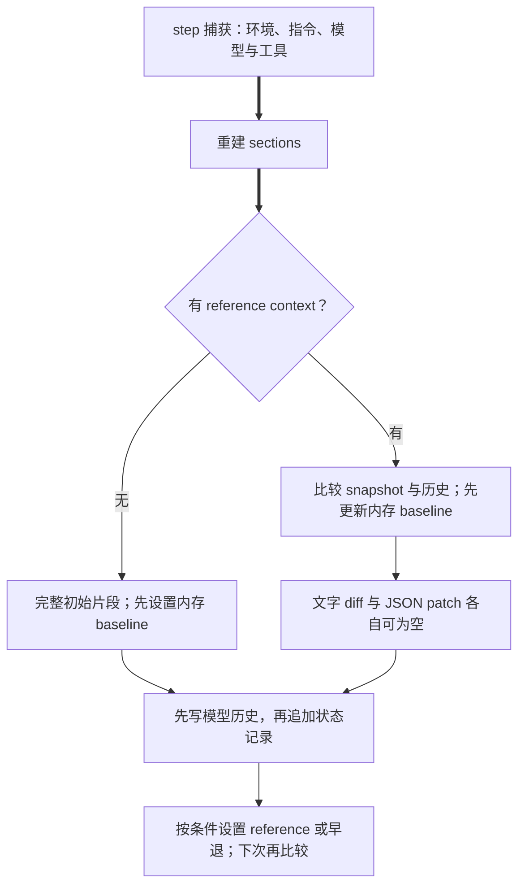
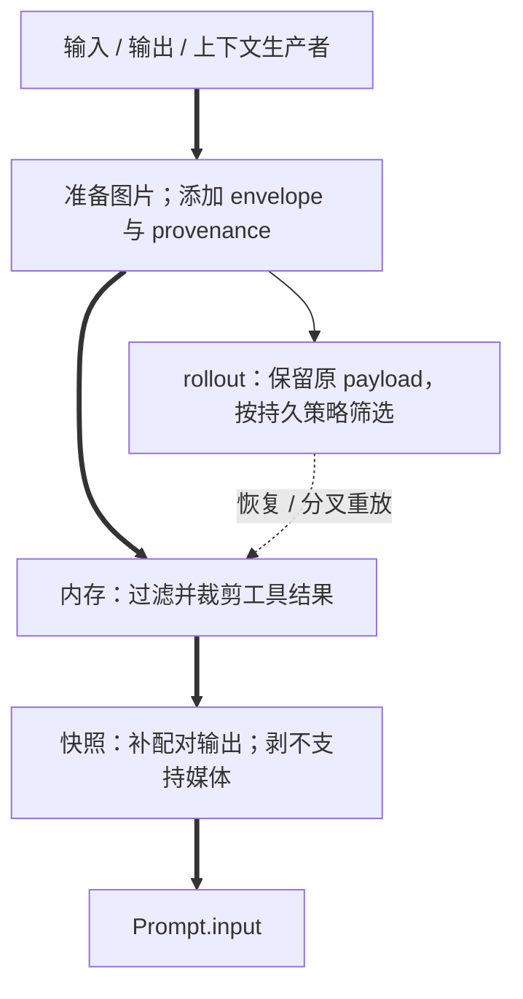

# S2–S4 指令、world state 与历史

这里解释 [S1](S1-request.md) 的上游：哪些内容长期保存，哪些状态每 step 比较，哪些副本最终用于请求。所有事实以当前 commit 为准，图为源码视图。

## S2 指令从哪里来、落在哪里

**结论**：base 单独存放；其他指令以有角色、有 markers/content kind 的片段进入历史。host 用户级/线程级指令与仓库 AGENTS.md 合为 `LoadedAgentsMd`，最终是 **user** 消息，并不会因为由 host 提供就自动升为 developer。

| 来源/默认值/读取者 | 转换与落点 | 证据 |
|---|---|---|
| base override → model instructions file → cfg.instructions；未指定则启动选择继承历史 base 或模型模板 | `SessionState` 保存；新明确配置/模板有 Custom/Model provenance，旧历史也可能是 None。历史文本仅在等于模型模板时补为 Model，否则仍可未知；`get_prompt_base_instructions` 只对 Model 来源剥禁用的 update_plan 内容，改的是请求副本；Prompt.base_instructions → wire 见 S1 | [Config](../../../codex/codex-rs/core/src/config/mod.rs:3987)、[启动](../../../codex/codex-rs/core/src/session/mod.rs:744)、[provenance](../../../codex/codex-rs/core/src/session/session.rs:786)、[读取](../../../codex/codex-rs/core/src/session/mod.rs:1489) |
| developer override.or(cfg.developer_instructions) | `DeveloperInstructions` → 初始 developer bundle | [默认合并](../../../codex/codex-rs/core/src/config/mod.rs:4006)、[role/body](../../../codex/codex-rs/core/src/context/developer_instructions.rs:17) |
| host user / thread snapshot 或 provider；仓库 root→cwd 每层首个 AGENTS.override.md / AGENTS.md / fallback | `LoadedAgentsMd::text`：user→thread→project；多环境给 project 分组标记；`UserInstructions` user 片段；变更/删除通知 | [加载](../../../codex/codex-rs/core/src/agents_md.rs:58)、[候选优先级](../../../codex/codex-rs/core/src/agents_md.rs:272)、[合并](../../../codex/codex-rs/core/src/agents_md.rs:386)、[role](../../../codex/codex-rs/core/src/context/user_instructions.rs:15)、[diff](../../../codex/codex-rs/core/src/context/world_state/agents_md.rs:52) |
| 当前模型模板与 previous model；Model provenance 才能从原模板辨认首次切换 | `ModelInstructionsState` 只比较模型 identity，变化且非空时输出 `ModelSwitchInstructions` developer；初始 bundle 插头部 | [决定](../../../codex/codex-rs/core/src/session/world_state.rs:52)、[分支](../../../codex/codex-rs/core/src/context/world_state/model.rs:44)、[片段](../../../codex/codex-rs/core/src/context/model_switch_instructions.rs:17) |
| 权限 profile、approval/reviewer、exec policy、cwd；include_permissions 默认 true | PermissionsInstructions developer；同 policy 只新增 prefix 可发 ApprovedCommandPrefixSaved；关闭全文则 CompactPermissionsState 只发后续新增 prefix | [默认开关](../../../codex/codex-rs/core/src/config/mod.rs:4007)、[构造](../../../codex/codex-rs/core/src/session/world_state.rs:168)、[diff](../../../codex/codex-rs/core/src/context/world_state/permissions.rs:94)、[关闭全文](../../../codex/codex-rs/core/src/context/world_state/compact_permissions.rs:39) |
| collaboration effective settings/model catalog；include_collaboration 默认 true | catalog override 优先，随后 settings developer text；识别内建模板才剥 update_plan；developer；移除时可输出空状态更新 | [构造和完整 diff](../../../codex/codex-rs/core/src/context/world_state/collaboration_mode.rs:24) |
| apps 默认 include=true，仍需 apps enabled、可访问且 enabled connector 与模型 usage 支持 | AppsInstructions developer；Unknown 旧历史不重注，关闭不发删除通知 | [判定](../../../codex/codex-rs/core/src/session/world_state.rs:254)、[diff](../../../codex/codex-rs/core/src/context/world_state/apps_instructions.rs:38)、[正文](../../../codex/codex-rs/core/src/context/apps_instructions.rs:28) |
| plugins available 与 model usage 支持；插件本身内容另见 S7 | AvailablePluginsInstructions / PluginInstructions 均 developer；recommended candidates 受 feature/config/auth 过滤，最多 50 条，只在初始构造追加 | [可用](../../../codex/codex-rs/core/src/session/world_state.rs:271)、[diff](../../../codex/codex-rs/core/src/context/world_state/plugins_instructions.rs:38)、[推荐](../../../codex/codex-rs/core/src/context/recommended_plugins_instructions.rs:15)、[初始调用](../../../codex/codex-rs/core/src/session/mod.rs:4333) |
| include_environment 默认 true；DeferredExecutor 另决定通用说明 | 动态 EnvironmentsState user；通用 EnvironmentsInstructions developer | [默认](../../../codex/codex-rs/core/src/config/mod.rs:4020)、[通用说明](../../../codex/codex-rs/core/src/context/environments_instructions.rs:14) |
| managed requirements.additional_developer_instructions（无值即不注入） | 独立 developer 消息；hash snapshot；replacement/removal notice；10k 估算 token 含开销，过大拒绝 | [构造](../../../codex/codex-rs/core/src/session/world_state.rs:327)、[验证与 diff](../../../codex/codex-rs/core/src/context/world_state/managed_developer_instructions.rs:54) |
| persistent execution feature、reasoning effort、模型模板、主 Agent async 用户消息工具能力 | PersistentModeState developer，启用渲染、替换/删除通知；Guardian 基本会话不加入 | [判定](../../../codex/codex-rs/core/src/session/world_state.rs:211)、[全部分支](../../../codex/codex-rs/core/src/context/world_state/persistent_mode.rs:50) |
| token budget/model 窗口与 guidance | TokenBudgetContext 单独 developer；ContextWindowGuidance developer diff，见 S10 | [入口](../../../codex/codex-rs/core/src/session/world_state.rs:126)、[guidance](../../../codex/codex-rs/core/src/context/world_state/context_window_guidance.rs:48) |
| multi-agent 版本/模式/角色提示 | usage hint→mode 顺序、developer，见 M3/M4 | [入口](../../../codex/codex-rs/core/src/session/world_state.rs:318) |

AGENTS.md 管理器在 startup 与 capture step 刷新。信号是环境 selections 或 active project trust level 改变，先清 repository cache；providers 每次 refresh 都调用，自行负责内部获取/缓存。若 user/thread 文本不变且 repository 不必重读，复用 loaded Arc；否则重组。仓库 untrusted 时不读项目文件；共享 project_doc_max_bytes 默认 32KiB 跨环境递减，文件可截断；thread host 指令超过 10k 估算 token **拒绝**。provider 警告保留，只有通过校验才替换应用快照。权限收紧时清 cache 发生在加载前，后续失败/取消不能据旧 cache 承诺继续可见。文件内容单独改变、而 selection/trust 未变，本函数没有 mtime 失效条件。[管理器完整定义](../../../codex/codex-rs/core/src/agents_md_manager.rs:65)、[startup](../../../codex/codex-rs/core/src/session/session.rs:1471)、[step/取消](../../../codex/codex-rs/core/src/session/mod.rs:3843)

**解释推断**：区分来源与角色、用替换通知追加历史，有利于保留 cache 稳定性与变更可追踪性；这不是所有文本大小都已被统一限制的证明。**替代方案**：每 step 重新读磁盘提高即时性，代价是 IO/远程环境等待；使用文件 watcher 会引入更多后台一致性状态。**待证**：host provider 的实际刷新频率/缓存策略由具体实现决定；本任务没有全体远端 provider 的运行记录。

## S3 world state 的重建与差异

**结论**：world state 是逐 step 重建的 typed sections 集合，历史中的文字与 rollout 中的比较快照是两种产物。存在 snapshot 变化而没有模型可见文字变化的分支。

`Session::build_world_state_for_step` 的源码 add 顺序是：model → 条件 token budget → context guidance → realtime → agents_md → permissions 或 compact prefixes → 条件 collaboration → 条件 persistent → 条件 environments → environments instructions → apps → plugins → 条件 tools → extensions → usage hint → mode → 条件 managed developer。realtime 在总容器中存在，但其专用工作流不属于本轮展开。host_skills extension 特别插到 permissions 之前；重复 section id 是 assert 失败，不能视作覆盖。[全序列](../../../codex/codex-rs/core/src/session/world_state.rs:40)、[扩展插入](../../../codex/codex-rs/core/src/context/world_state/mod.rs:374)

环境 section 从 TurnEnvironmentSnapshot 的 ready/starting/selected 环境取 cwd、shell、status/error/primary；当前日期从 Session clock 按 chrono::Local 转日期，timezone 来自 turn，network 由 turn context，filesystem 从 primary profile/workspace roots。V2 子路径来自 child_agent_paths，最多 8 条、1,024 bytes；V1/Disabled 走 legacy formatter。环境构造是 async，PowerShell 条件分支可以读取 shell version。[数据源](../../../codex/codex-rs/core/src/context/world_state/environment.rs:41)、[环境集合](../../../codex/codex-rs/core/src/context/world_state/environment.rs:459)、[子列表](../../../codex/codex-rs/core/src/session/world_state.rs:86)

| 比较状态 | 实际含义与处理 |
|---|---|
| Absent | 没有 snapshot/对应 retained fragment；每个 section 自己决定初始输出，不能说所有 section 必发全文（model、compact prefixes 有特殊条件） |
| Unknown | retained history 有 legacy fragment、没有 typed snapshot；不等于空白。反序列化失败也降级 Unknown。AGENTS/managed/guidance 可给替换，apps/plugins 通用说明选择不重复 |
| Known(value) | 精确可反序列化的比较状态；相同常返回 None，变化按 section render_diff。部分 section 有 matcher，snapshot 有但对应历史片段被裁去则按 Absent 重新注入 |

接口 enum 是 `codex_extension_api::...::PreviousWorldStateSection`；core 用 `PreviousSectionState` 并适配给 extension。不能把三种状态简化为“有无上次值”。[转换](../../../codex/codex-rs/core/src/context/world_state/mod.rs:116)、[对历史匹配](../../../codex/codex-rs/core/src/context/world_state/mod.rs:422)

无 reference_context_item 时，record_context_updates 生成初始全文、设置 WorldState baseline，依次写 model-visible items、WorldState(full)、必要 TurnContext，再设置 reference。有 reference 时从 ContextManager update_world_state 得到 fragments 与 patch；TurnContext 改变时另加入 turn contributor。仅 world-state 改且没有 context items 时可只持久化 patch，不重复 TurnContext。持久化函数返回 bool，调用处未把失败都提升为事务错误，不能声称这些写入是磁盘原子提交。[全部分支](../../../codex/codex-rs/core/src/session/mod.rs:4677)

同一 turn 的 step 更新使用 live WorldState 与当前 step 生成 diff，先写文字，再更新内存 baseline、追加 WorldState patch。Snapshot merge-patch 是 RFC7386 风格：null 表示删 key、object 递归、数组/标量整体替换，snapshot 构造去掉 object null。模型切换本身发 model diff，不保证一定清 reference；rollback、replacement history/新窗口/compaction 可能清掉或另立基线，详见 S11。[step 更新](../../../codex/codex-rs/core/src/session/mod.rs:3684)、[patch](../../../codex/codex-rs/core/src/context/world_state/mod.rs:314)、[rollback 清空](../../../codex/codex-rs/core/src/context_manager/history.rs:981)

**独立复核发现**：EnvironmentsSnapshot 包含 subagents；但 `render_diff` 的 turn_context_values_changed 没比较 subagents，最终产生片段的条件只看 environment updates 或该 bool。仅子列表变化可产生持久化 patch而没有即时 user diff。这个是静态分支结论；是否为产品缺陷、是否由其他消息通道弥补，待运行场景确认，不改产品源码。[snapshot](../../../codex/codex-rs/core/src/context/world_state/environment.rs:108)、[决定输出](../../../codex/codex-rs/core/src/context/world_state/environment.rs:146)

图表示 `record_context_updates_and_set_reference_context_item` 的跨回合分支，控制边依据 capture / `4677–4755`：full/diff 都先推进内存 baseline，再写模型文字和 durable 状态；snapshot-only 可提前返回。**同回合 step 更新另有时点**：`3684–3724` 先写文字，再推进 baseline，最后追加 patch。两者不能统一画成“持久化之后才推进 baseline”。**解释推断**：将“模型知道什么”和“持久比较什么”分开，允许小 patch 与兼容旧历史；代价是两个视图可能不同。**替代方案**：每次全文简单，但开销和 cache churn 更大；仅比较 JSON 无法发现 fragment 已被裁掉。**待证**：IO 失败后的实际恢复、时间/异步变化具体到达顺序、各扩展远端返回行为。

## S4 历史如何写入和用于请求

**结论**：SessionState.history 是 ContextManager；核心存储为 `Arc<Vec<ResponseItemEnvelope>>`，包含 response item 和 harness metadata，快照借用直到 copy-on-write。rollout 是多种 RolloutItem 的持久日志，不等同于当前模型窗口。[字段](../../../codex/codex-rs/core/src/context_manager/history.rs:91)、[RolloutItem 类型](../../../codex/codex-rs/history/src/lib.rs:201)

常规入口 `record_conversation_items` 先 prepare 图片/历史条目，再 envelope 化、保留或补 tool truncation budget、turn/source/input order 与 MCP attribution checkpoint。ContextManager 记录时 clone 条目，仅 live history 的 FunctionCallOutput/CustomToolCallOutput 按 override 或模型 policy（含 serialization allowance）截断；传出的 envelopes 保留完整工具 payload并加 retained_source。随后原 envelopes 变 RolloutItem::ResponseItem 交持久化，再发 raw response events。[入口到出口](../../../codex/codex-rs/core/src/session/mod.rs:3538)、[metadata](../../../codex/codex-rs/core/src/session/mod.rs:3568)、[内存裁剪](../../../codex/codex-rs/core/src/context_manager/history.rs:533)、[持久化](../../../codex/codex-rs/core/src/session/mod.rs:3664)

| 写入口 | 条目及交接 |
|---|---|
| 用户/hook/additional/skills/host/runtime context | ResponseItem 消息，经过常规 record；详细生产者在 S6/S7 |
| 模型 OutputItemDone 与工具 future | 模型 item 先记；工具执行的 ResponseInputItem 转 ResponseItem 再记；详细见 S5 |
| world state 与 step update | rendered developer/user messages 进历史；WorldState/TurnContext 另入 rollout；见 S3 |
| mailbox/通知/board | 专用 communication→model item，同时保存 communication/provenance；见 M5/M6/M8 |
| compaction/resume/fork/rollback | replace/replay/truncate 接口重建 history与基线，不是仅 append；见 S11/M1/M10 |

内存 `is_api_message` 丢原始 system message、非 harness-authored ConfigurationUpdate、CompactionTrigger、Other；其他列明 ResponseItem 接受。rollout 另有 policy：ResponseItem::AdditionalTools、CompactionTrigger、Other 不持久；模型消息、工具结果、ConfigurationUpdate 等保留。两套过滤不同，不能用一方证明另一方。[内存过滤](../../../codex/codex-rs/core/src/context_manager/history.rs:998)、[rollout policy](../../../codex/codex-rs/rollout/src/policy.rs:10)

交给模型前 `for_prompt(self)` 消费快照，补 tool outputs、去 orphan outputs、按 modalities 剥媒体、剥 envelope。孤儿判断不看 name：FunctionCallOutput 的 call_id=None 不进入该检查；ToolSearchOutput 的 call_id=None 或 execution="server" 也不进入对应检查；named output 若有不配对的 Some(call_id)，仍会被处理。[完整孤儿分支](../../../codex/codex-rs/core/src/context_manager/normalize.rs:155) 调用 [error_or_panic](../../../codex/codex-rs/core/src/util.rs:81)：debug_assertions 下可 panic，其他构建记录错误后补/删；missing custom/local-shell outputs 也经过此函数，不能保证所有构建都能完成 normalization。原 live history 不因快照规范化直接被重写；S1 wire 清理是下一层。[规范化](../../../codex/codex-rs/core/src/context_manager/history.rs:581)、[四步](../../../codex/codex-rs/core/src/context_manager/history.rs:933)

图各边依据 `record_prepared_conversation_items` 与 `record_item_with_metadata` 的复制/调用和 S11 replay，不由调用图推断 payload 相同。错误/取消：常规 record 的签名不返回 Result；append 失败 log+false，不能说失败会回滚内存。reset/rollback 是明确特殊入口。**解释推断**：保留 originals 与 provenance 支撑重放/审计，live 工具输出按预算裁剪。**替代方案**：只存裁剪结果省空间但失去再处理材料。**待证**：磁盘失败重启一致性与具体截断内容的运行结果。

## 符号互证与复核范围

锚点与 canonical identities 已列在 [23 问清单](01-question-coverage.md) 的 S2/S3/S4；原始 LSP q 和 cand_key 保存在 [question-coverage.json](question-coverage.json)。这里主要符号为 `AgentsMdManager::refresh`、`Session::build_world_state_for_step`、`WorldState::render_history_diff`、`WorldStateSnapshot::merge_patch_from`、`Session::record_conversation_items`、`ContextManager::record_item_with_metadata/for_prompt`。本轮从输出角色与 history record 副本反向复核生产者，完整读了对应核心分支；traits 的运行目标仍以实际构造/注册为界。没有重新执行 S4 或运行测试。
