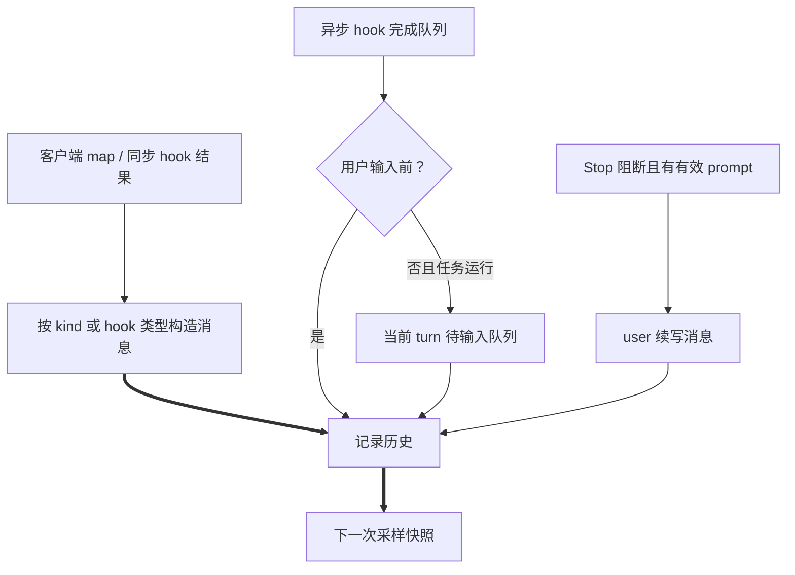
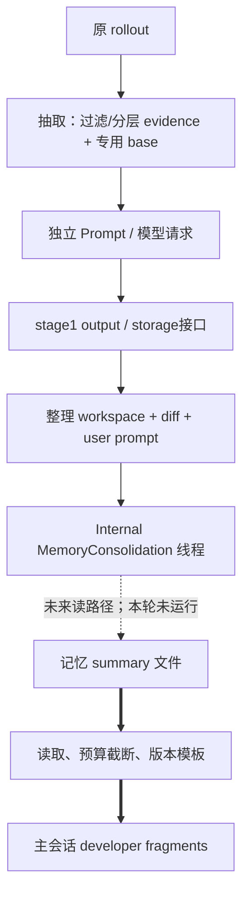

# S5–S8 上下文生产者与交接

本组承接 [S2–S4](S2-S4-state-history.md)，每条链路以实际对象转换与写点证明内容去向。符号完整身份、锚点与原查询在 [覆盖清单](01-question-coverage.md)、[原记录](question-coverage.json)。

## S5 工具调用、结果如何进入历史

**结论**：正常 dispatch 的调用与结果分两次记入，靠 call_id 关联。路由阶段的错误回填有空 call_id 例外，不能因此宣称所有条目都正常配对。工具执行 future 不直接等同于已写历史；结果要被采样层 drain 消费后才写入。

入口 `codex_core::stream_events_utils::handle_output_item_done` 对 `ToolRouter::build_tool_call` 全 match：Some(call) 先记录模型 item，再派生 child cancellation token、构造 in-flight future，返回 needs_follow_up=true；None(call) 走普通 message/reasoning 完成事件与历史记录；RespondToModel 仍先记录 call，再把错误文本 FunctionCallOutput 转为 ResponseItem 入历史并继续；Fatal 直接返回 CodexErr::Fatal，不能据注释声称它也写了错误历史。[完整分支](../../../codex/codex-rs/core/src/stream_events_utils.rs:315)

工具输出的 `ToolOutput::to_response_item` 返回 `ResponseInputItem`，转换接口 `response_input_to_response_item` 明确处理 FunctionCallOutput、CustomToolCallOutput、McpToolCallOutput、ToolSearchOutput；MCP 变为 FunctionCallOutput。其他输入（如 Message）在这个转换函数返回 None，不表示它不能经其他接口进历史。正常运行的结果 envelope 由工具 runtime 返回，`drain_in_flight` 从 FuturesOrdered 顺序消费，再 `record_annotated_conversation_items`。异步执行可并行，消费顺序不证明完成时间顺序。[转换](../../../codex/codex-rs/core/src/stream_events_utils.rs:546)、[结果消费者](../../../codex/codex-rs/core/src/session/turn.rs:2466)

**错误条目的出口不能省略。** 本 commit 的 [ToolSearch 参数解析失败](../../../codex/codex-rs/core/src/tools/router.rs:267) 可返回 RespondToModel；[stream 分支](../../../codex/codex-rs/core/src/stream_events_utils.rs:400) 保存原 call，再保存 call_id 为空的 FunctionCallOutput。随后 [normalize](../../../codex/codex-rs/core/src/context_manager/normalize.rs:21) 会给 ToolSearchCall 补同 id 的空 ToolSearchOutput，并对没有对应 call 的空 id FunctionCallOutput 调 [error_or_panic](../../../codex/codex-rs/core/src/util.rs:81) 后移除（debug_assertions 分支会 panic）。这只是源码推导，未运行；“错误文本进 live/rollout”不等于它必进入下一次 Prompt。

截断来自当前 model_info.truncation_policy → TruncationPolicy（Bytes/Tokens），record_prepared 时写 budget metadata，**已存在工具级 history_truncation_token_limit 不覆盖**。ContextManager 对两类 output 的 live 副本优先 override，否则加 serialization allowance；MCP 对外形态也落此分支。原始 payload 留在 rollout。工具级 `ExecutedToolCallTruncation` 的换算与执行阶段输出限额是 Tool Execution 的交接，不在此展开算法。[默认/保留 override](../../../codex/codex-rs/core/src/session/mod.rs:3568)、[消费者](../../../codex/codex-rs/core/src/context_manager/history.rs:546)

出口为 history→下次 for_prompt；未完成/中断的调用可能由 normalization 补 synthetic output。drain future Err 使用 error_or_panic 记录异常，不能声称该分支一定提供业务工具输出。取消可取消 child token，具体工具如何收场由其 runtime 决定。**解释推断**：先保存 call、后消费结果，有利于中断/重放保留因果材料。**替代方案**：只在执行后整体写入可简化配对，但中断会失去已经发出的 call。**待证**：每类工具具体取消结果、serialization allowance 的实际输出字节；未运行 truncation/audio 测试。

## S6 additional context 与 hooks

**结论**：客户端 map 的 kind 决定角色；hooks 的普通附加内容与 Stop 续写是不同通道。去重只在客户端 AdditionalContextStore 中明确存在，不能移植到 hooks。

| 生产者→转换→存储→消费者 | 条件/时机/边界 |
|---|---|
| 客户端 `BTreeMap<String, AdditionalContextEntry>` → state.additional_context.merge → TurnInput::ResponseItem → pending/record → history | 逐 key 与旧 map 比较 kind+value，相同不发；新 map **替换**旧 map，删除 key 没有显式 removal 消息；Untrusted 为 user `<external_key>`，Application 为 developer `<key>`；单个 value middle trunc 1,000 估算 tokens，不限制 key 的总数 |
| SessionStart / SubagentStart outcome → record_additional_contexts → HookAdditionalContext → history | pending start source 在用户输入之前消费；ThreadSpawn startup/fork 走 SubagentStart，其他 SubAgent 不运行 start hook；should_stop 可结束当前路径 |
| UserPromptSubmit inspect → record_pending_input → record_additional_contexts | 只对 TurnInput::UserInput 触发；accept 输入先记，再加该 hook context；阻断路径另记其 context，流程不继续普通采样 |
| PreToolUse | 执行前调用并记录 developer context，再处理 should_block/updated_input；没有 block_reason 的 should_block 分支回 Continue(None) |
| PostToolUse | registry 只在成功且有 post payload 时运行，记录 developer context；block 拒绝已完成工具的结果，不撤销执行 |
| async hook result channel | before_user_prompt=true 直接记录；采样与工具结束后 false 时仅 inject 到当前 running task pending queue；无 active task 返回 Err，当前 caller 忽略返回，不能承诺结果会保存或另起回合 |
| Stop / SubagentStop continuation_fragments | block 且生成有效 hook prompt 时写 **user** Message（要求非空 hook_run_id），设置 stop_hook_active 再采样；block 没有效 prompt 警告后忽略；should_stop 结束；memory consolidation 被 block/stop 则返回 InvalidRequest |

证据：[客户端 store](../../../codex/codex-rs/core/src/state/additional_context.rs:16)、[接入](../../../codex/codex-rs/core/src/session/turn_input.rs:722)、[角色/截断](../../../codex/codex-rs/context-fragments/src/additional_context.rs:22)、[start](../../../codex/codex-rs/core/src/hook_runtime.rs:128)、[user input](../../../codex/codex-rs/core/src/hook_runtime.rs:677)、[pre](../../../codex/codex-rs/core/src/hook_runtime.rs:188)、[post consumer](../../../codex/codex-rs/core/src/tools/registry.rs:718)、[async drain](../../../codex/codex-rs/core/src/hook_runtime.rs:782)、[inject 判定](../../../codex/codex-rs/core/src/session/inject.rs:45)、[Stop](../../../codex/codex-rs/core/src/session/turn.rs:653)、[prompt 角色](../../../codex/codex-rs/protocol/src/items.rs:680)。

普通 HookAdditionalContext::body 只 clone text，包装层没有本地 truncation 或去重；不据 AGENTS 的审查规则认定所有 hook output 已有统一硬上限。上游 hook runner 的输出限制、全部 hook 类型的错误语义尚需专门核对；这是局部缺口，不扩大 Context 范围。[包装](../../../codex/codex-rs/core/src/context/hook_additional_context.rs:15)

图边映射是上表 producer/consumer 双端；不存在 running task 的 async 分支不连到 H。**解释推断**：在采样边界投递 async 内容，减少在途请求被任意改写；它不保证不丢结果。**替代方案**：无任务时保留为下次 turn context 可减少丢失，需要定义持久生命周期。**待证**：channel arrival 与取消竞态、runner 上游限额；没有运行 hooks 场景。

## S7 扩展与运行时注入清单

**结论**：扩展可交提示片段、world-state section、回合输入或工具能力；四者的消费位置不同。“注册扩展”只证明具备接口，feature/状态决定是否实际贡献。

| 接口/生产者 | 转换、保存、消费者与分支 | 源码 |
|---|---|---|
| ContextContributor::contribute_thread_context | 全量初始构造调用；DeveloperPolicy/Capabilities 汇入 developer bundle，ContextWindow 文本作为预算 hints，需 TokenBudget + 已知窗口才生成 TokenBudgetContext；不满足条件不能认定 hints 已入历史 | [slot](../../../codex/codex-rs/ext/extension-api/src/contributors/prompt.rs:8)、[消费](../../../codex/codex-rs/core/src/session/mod.rs:4358) |
| contribute_turn_context | 初始与 TurnContext 改变时调用；PromptFragment::into 始终 developer，此处不根据 slot 再拆分 | [trait](../../../codex/codex-rs/ext/extension-api/src/contributors.rs:124)、[steady 消费](../../../codex/codex-rs/core/src/session/mod.rs:4269) |
| contribute_world_state | 每 step 传模型、环境、previous snapshot、stores、capability roots；producer 返回 id+snapshot+renderer；core adapter 将 role/body 送 history diff并把 snapshot持久化 | [调用](../../../codex/codex-rs/core/src/session/world_state.rs:296)、[adapter](../../../codex/codex-rs/core/src/context/world_state/mod.rs:146) |
| TurnInputContributor::contribute | 使用本轮 user_input 与环境，逐注册者 await；返回 boxed ContextualUserFragment 按各自 role→ResponseItem；取消返回 None 结束该组构造 | [完整消费](../../../codex/codex-rs/core/src/session/turn.rs:1177) |
| ToolContributor::tools_for_step | 生成 executor/spec，经过 registry policy/tool-mode/collision 等路由整合；模型可见 specs 最终进入 Prompt.tools，工具定义不是历史消息 | [读取](../../../codex/codex-rs/core/src/tools/spec_plan.rs:332)、[Prompt](../../../codex/codex-rs/core/src/session/turn.rs:1589) |
| 同回合 inject 接口 | 存在 active_turn 时投递到该 turn 的 pending input；无 active_turn 返回原 input。此普通接口不额外检查 task，hook 专用接口另有 task gate；只要有接口不能证明某插件本轮调用过 | [注入](../../../codex/codex-rs/core/src/session/inject.rs:17) |
| skills / plugins | explicit mentions 与 skills snapshot 读取 skill prompt；dedup 已注入 host path；结果顺序 skill_items→plugin_items→extension_items；接受 user input 后逐项记录 | [完整组装](../../../codex/codex-rs/core/src/session/turn.rs:1032)、[写入](../../../codex/codex-rs/core/src/session/turn.rs:398) |
| host InternalModelContextFragment | source 约束为 `[a-z][a-z0-9_]*`，包 `<codex_internal_context source="...">`，user role；识别时兼容旧 `<goal_context>`。不能由类型宣告推定 host 已发送 | [角色/正文](../../../codex/codex-rs/core/src/context/internal_model_context.rs:79) |
| 时间提醒 | feature + config + clock 可读；window/elapsed/delivery mode判定到期；CurrentTimeReminder 写 history，位于 sampling 前 | [状态机](../../../codex/codex-rs/core/src/session/time_reminder.rs:63)、[写入](../../../codex/codex-rs/core/src/session/time_reminder.rs:156) |
| 中断标记 | 配置与 multi-agent version决定 disabled/contextual user/developer，再进入中断/分叉历史；不将用户取消当作普通 user prompt | [选择](../../../codex/codex-rs/core/src/tasks/mod.rs:77) |
| 用户 shell 输出、图片缩放说明 | shell执行结果格式化为 UserShellCommand，图片准备阶段可能重写输入并产 image metadata/说明；执行和图像处理算法是交接边界 | [shell 生产](../../../codex/codex-rs/core/src/user_shell_command.rs:9)、[图片准备接口](../../../codex/codex-rs/core/src/session/mod.rs:3416) |

app-server 此 commit 的生产安装表：可选 admission/queue；history-notes、agent message board；有 state_db 时 goal；git-attribution、guardian-v2、memories、MCP、MCP plugins、web search、image generation、skills（host+executor providers）。不是所有入口都装同一 registry；CLI/debug 有自己的安装路径，S12 只在所选入口比较。[完整注册函数](../../../codex/codex-rs/app-server/src/extensions.rs:50)

源码 fact：thread/turn/world hook 默认实现返回空，不能把 trait 所有实现连为实际执行对象。[默认实现](../../../codex/codex-rs/ext/extension-api/src/contributors.rs:109) **解释推断**：生命周期明确的贡献接口减少 core 对具体插件的依赖，但把限额/刷新语义分散到 producer。**替代方案**：单个统一 context builder 易统一预算，却会增加耦合。主要已安装扩展的 gate、可选贡献、空/错误结果与消费边界已补在 [S7/S10 分支补充](S7-S10-optional-branches.md)。具体远程/provider 的实际输出和每种 feature 组合仍待运行验证，接口以外的 selector/审批算法保持原题边界。

## S8 Memories 的读路径和写接口

**结论**：读路径注入的是 summary 与读取指引，不是全部记忆文件。写路径的抽取 Prompt 和整理线程各自组织输入，不能把写入结果视作即时主历史更新。

读入口 `MemoriesExtension::contribute_thread_context` 从 thread store 读取 MemoriesExtensionConfig；enabled 是 MemoryTool feature **且** memories.use_memories。读取 codex_home/version.directory_name()/memory_summary.md，读取失败或 trim 后为空返回 None；summary 按 2,500 token policy截断后填版本模板，render 失败也 None。V1 一个 instructions；V2 分成不超过 8,900 bytes 的 UTF-8 片段，MemoryContextFragment::ReadInstructions developer；再包 developer_policy PromptFragment 汇入 S7 全量构造。每片段 cap 不等于聚合 developer Message 总 cap。它在全量构造时读取，不是任意文件变动立刻更新主历史。[入口及完整分支](../../../codex/codex-rs/ext/memories/src/extension.rs:45)、[读取和模板](../../../codex/codex-rs/ext/memories/src/prompts.rs:35)、[限额](../../../codex/codex-rs/ext/memories/src/lib.rs:16)、[typed roles/cap](../../../codex/codex-rs/core/src/context/memory.rs:15)

抽取接口 `phase1::sample` 读 rollout；V1 过滤序列化→单 user message，V2 tiered input→按 UTF-8 切段的 ExtractionEvidence **user** messages。专用 base instructions + output schema strict=true；Prompt default tools 为空。`stream_stage_one_prompt` 新建 ModelClient/session，与主 turn 不共享 continuation；trace disabled，读取 text delta/最终 Message并取 Completed usage，随后 parse StageOneOutput，交 storage接口。V2 tiers的选择有明确预算优先级，然后按原 rows顺序重组；不是用调用图推断数据重要性。[Prompt 全字面量](../../../codex/codex-rs/memories/write/src/phase1.rs:259)、[evidence转换](../../../codex/codex-rs/memories/write/src/rollout_input.rs:199)、[独立 stream](../../../codex/codex-rs/memories/write/src/runtime.rs:314)

整理接口：phase2从 DB-backed stage1 outputs 同步 memory workspace、写 diff；agent::get_prompt 包专用 user text（root路径/版本模板），clone config 改 cwd 为 memory root、ephemeral、关 use/generate memories/通知/apps/plugins/MCP/Collab、Never approvals，并根据父 profile限定环境，换 consolidation model/reasoning。`spawn_consolidation_agent` 用 ThreadManager::start_thread，SessionSource::Internal(MemoryConsolidation)，提交 user input；未启动则 shutdown并返回错误。base/config的其他继承内容仍经过正常初始化，不能说这里只含专用prompt。完成后的产物是 workspace记忆，未来读取时进入主 Context；本任务不展开记忆抽取/整理算法。[准备交接](../../../codex/codex-rs/memories/write/src/phase2.rs:94)、[config+prompt](../../../codex/codex-rs/memories/write/src/phase2.rs:296)、[spawn与错误](../../../codex/codex-rs/memories/write/src/runtime.rs:398)

图主干 F→R→D 为已读函数字段；O→E→P→S 为 phase1 sample返回与 runtime stream；S→W→I 为 phase2输入与spawn。最后虚线是持久产物的后续消费设计，未证明某次运行成功。**解释推断**：分离离线证据处理与主模型输入，让记忆以小摘要重用；**替代方案**：直接注入全部历史资料会提高覆盖但占窗口，检索按需读取则增加工具往返。**待证**：真实 summary 内容、模板字数与失败场景、stage1/2完成后刷新时点；不访问个人记忆文件、不运行流水线。
