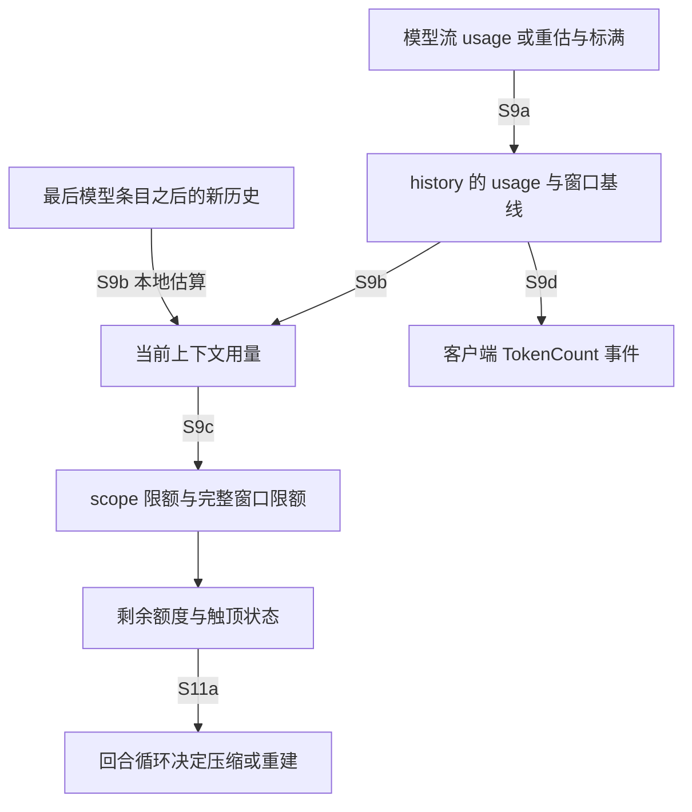
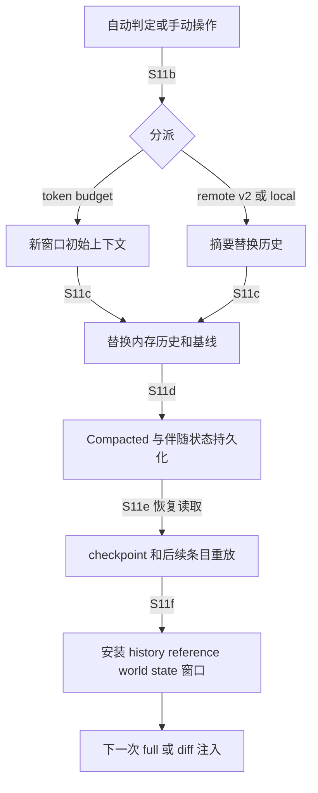

# S9–S12：计数、预算、上下文切换与观察层

源版本和正式范围见 [输入核对](input-audit.json)；锚点身份见 [23 问清单](01-question-coverage.md)。以下是源码级路径，未编译、未运行模型请求；图不是 MIR CFG/DFG。

## S9：服务端计数与本地估算共同驱动窗口判断

**结论。** 当前上下文用量不是整段会话的累计账单。`get_total_token_usage` 读取最近记录的 `last_token_usage.total_tokens` 基线，加上最后一个模型生成条目之后新增历史的估算；服务端未计入旧 reasoning 时再补估。正常流的基线来自服务端，但重建后可被本地重估覆盖，ContextWindowExceeded 也可将它标满。累计 usage、当前窗口 usage、自动压缩口径是不同对象。

入口是模型流结束后的 `TokenUsage`，出口包括 `TokenCount` 客户端事件和 `ContextWindowTokenStatus` 决策对象。[记录 usage](../../../codex/codex-rs/core/src/session/mod.rs:4803) 更新 history 的 `TokenUsageInfo`、模型分组账目和窗口前缀，再通知 token-usage contributors、rollout budget；[发送事件](../../../codex/codex-rs/core/src/session/mod.rs:4925) 带 usage 与 rate limits。`None` usage 不凭空产生准确计数。[当前用量公式](../../../codex/codex-rs/core/src/context_manager/history.rs:904) 的后续历史估算用 [条目模型可见字节](../../../codex/codex-rs/core/src/context_manager/history.rs:1039)，不是 JSON 请求的完整传输字节。

| 消费口径 | 来源、转换与用途 |
|---|---|
| 当前上下文 `active_context_tokens` | 最近记录基线（服务端/本地重估/标满）+ 后续本地估算，供窗口判断 |
| `Total` 自动压缩口径 | active；limit 来自模型 `auto_compact_token_limit` |
| `BodyAfterPrefix` | active 减 `SessionContextWindow.prefill_input_tokens`；尚无该值时取 active 为基线；limit 优先配置，否则模型默认 |
| 完整窗口硬上限 | 模型 resolved window × effective percentage；即使只按 body 计自动压缩，仍检查完整窗口 |
| remaining | 已知 scope 和完整窗口剩余额度取较小值；未知上限保留 `None` |
| 触顶/回合后阈值 | 比较 scope 的 base limit 加可选 fallback buffer，或完整窗口硬上限；回合后另检查百分比阈值 |

表中分支完整位于 [context_window_token_status](../../../codex/codex-rs/core/src/session/context_window.rs:53)。本地 [recompute_token_usage](../../../codex/codex-rs/core/src/session/mod.rs:4851) 重估替换后的历史和 base instructions，更新 last usage 的估算，保留累计账目；不能把估算当作服务端实际收费。S1 的 `ContextWindowExceeded` 分支把已知窗口计数标满并返回错误，而不是在请求重试中无限删历史：[错误出口](../../../codex/codex-rs/core/src/session/turn.rs:1668)。

边证据：S9a [流 usage 写入](../../../codex/codex-rs/core/src/session/mod.rs:4803)、[本地重估](../../../codex/codex-rs/core/src/session/mod.rs:4851)、[标满窗口](../../../codex/codex-rs/core/src/session/mod.rs:4940)；S9b [公式](../../../codex/codex-rs/core/src/context_manager/history.rs:904)；S9c [判定](../../../codex/codex-rs/core/src/session/context_window.rs:53)；S9d [事件](../../../codex/codex-rs/core/src/session/mod.rs:4925)；S11a [回合分支](../../../codex/codex-rs/core/src/session/turn.rs:601)。箭头表示值传递/源码分支，不证明实际运行时已走过。

## S10：预算在多个交接点起作用

**结论。** 没有一个统一的“最后对 `Prompt` 裁剪”入口。不同生产者在配置验证、片段生成、记录 history、图片准备和压缩结果保留时分别限额；即使某模块不引用 `Prompt`，它仍可通过 history 或 world state 影响之后的 input。

**引用风险核对。** 对 `session/token_budget.rs`、`session/rollout_budget.rs`、`rollout_budget.rs`、`agent/control/budget.rs`、`context/token_budget_context.rs`、`context/rollout_budget.rs`、`context/world_state/tools_budget.rs` 与两个窗口工具文件进行离线 `rg '\bPrompt\b'`，无匹配。这个负证据只限所列文件；实际影响由下面的 history/fragment/工具输出消费链证明，不能用“不引用 Prompt”推断“不影响模型请求”。

Token budget 配置由 [配置解析](../../../codex/codex-rs/core/src/config/mod.rs:2843) 和 [按当前模型解析](../../../codex/codex-rs/core/src/session/token_budget.rs:81) 共同确定。显式配置、feature 管理约束、模型默认消息和资格条件分开处理，不能概括成所有模型默认开启。验证要求 threshold/buffer 为正、fallback prompt 配有 buffer，模板/guidance/fallback 各有 2000 字节限制：[验证](../../../codex/codex-rs/core/src/config/mod.rs:1191)。窗口开发者片段包含 agent path、first/current/previous window id，另有 guidance：[类型和角色](../../../codex/codex-rs/core/src/context/token_budget_context.rs:12)。其 world-state snapshot 只取 agent path，窗口重建通过 full injection 写新 id；不能据这个 snapshot 推断 id 的每次变化会触发 diff。

[maybe_record](../../../codex/codex-rs/core/src/session/token_budget.rs:161) 用窗口状态领取一次性提醒/fallback 状态，再将 developer 片段记录进历史。`get_context_remaining` 读取同一判定对象，但返回的是 **function tool output**（含剩余 token 文本），不是另发 developer 消息：[handler](../../../codex/codex-rs/core/src/tools/handlers/get_context_remaining.rs:70)。`new_context_window` 设置 session 请求标志并返回 tool output：[handler](../../../codex/codex-rs/core/src/tools/handlers/new_context_window.rs:27)；[回合循环](../../../codex/codex-rs/core/src/session/turn.rs:601) 仅在 `needs_follow_up` 时消费请求/检查触顶。满足条件后才进入 S11 的实际执行接口。

Rollout budget 由 [配置解析](../../../codex/codex-rs/core/src/config/mod.rs:2887) 选择正的总 limit、有效阈值和非负有限 weights。[累计器](../../../codex/codex-rs/core/src/rollout_budget.rs:48) 优先采用服务端 `codex_rollout_budget_units`，否则按输出与非缓存输入加权；非法服务端值返回 fatal error。[提醒交接](../../../codex/codex-rs/core/src/session/rollout_budget.rs:9) 先将 developer `<rollout_budget>` 写入历史，再标记线程/窗口的阈值已交付，以避免取消前被提前消耗。[片段](../../../codex/codex-rs/core/src/context/rollout_budget.rs:9) 明说 shared session weighted tokens；树级所有权见 M7。

| 限额对象 | 起作用的位置与结果 | 证据 |
|---|---|---|
| 工具输出 | live history 按条目 override 或模型 truncation policy 缩短；rollout 保存原 envelopes | [S4/S5](S2-S4-state-history.md)、[history](../../../codex/codex-rs/core/src/context_manager/history.rs:533) |
| key/value 附加上下文 | 单 value 1000 tokens、中间截断；hook 附加上下文是另一类型，不能套同一限制 | [S5/S6](S5-S8-producers.md)、[截断器](../../../codex/codex-rs/context-fragments/src/additional_context.rs:94) |
| 线程指令 / repository AGENTS | 线程指令超过约 10k tokens 的 byte 阈值拒绝；项目文件消耗共享 byte allowance | [S2](S2-S4-state-history.md)、[验证](../../../codex/codex-rs/core/src/agents_md_manager.rs:170) |
| managed/user-context subagent 列表 | managed instructions 连同替换说明/markers 验证约 10k tokens；subagent 列表限制 8 个/1024 bytes | [managed](../../../codex/codex-rs/core/src/context/world_state/managed_developer_instructions.rs:54)、[world state](../../../codex/codex-rs/core/src/session/world_state.rs:35) |
| 记忆 | summary 2500 tokens；带类型片段 body 8900 bytes 分块 | [S8](S5-S8-producers.md) |
| deferred tool namespace | fragment 总 4096 bytes；描述先限制 250 chars；名字优先，描述按 UTF-8 逐字分配，过多名字留下 omission | [渲染](../../../codex/codex-rs/core/src/context/world_state/tools.rs:153)、[分配](../../../codex/codex-rs/core/src/context/world_state/tools_budget.rs:1) |
| 图片准备 | feature + 模型能力选择 UnifiedBudget/DetailBased；统一模式用 ORIGINAL_DETAIL，缩放后保留 original hint 供本地计数；处理错误变成占位文本；上传错误回退 inline，File 引用绕过，可另附 resize notice | [入口](../../../codex/codex-rs/core/src/session/mod.rs:3416)、[模式](../../../codex/codex-rs/core/src/image_preparation.rs:45)、[转换](../../../codex/codex-rs/core/src/image_preparation.rs:380) |
| 图片本地估算 | 非 original 7373 字节估算；original 32px patch，源码上限 10000 patches；这是本 commit 估算常量 | [估算](../../../codex/codex-rs/core/src/context_manager/history.rs:1044) |
| 远程压缩保留图片 | CompactionImageBudget 开关；新到旧消耗保留额度，图片与标签原子保留/删除，边界文本可缩短 | [结果接口](../../../codex/codex-rs/core/src/compact_remote_v2.rs:311)、[额度消费](../../../codex/codex-rs/core/src/compact_remote_v2.rs:623)、[图片原子组](../../../codex/codex-rs/core/src/compact_remote_v2_images.rs:31) |

尺寸公式、格式转换、metadata、缓存与上传回退已补在 [S7/S10 分支补充](S7-S10-optional-branches.md)，相邻 utils/image 明确标注为原 Scope 外直接 helper 补读。静态计数常量不等于服务端计费规则。

## S11：触发与回写分开，历史与基线一起恢复

**结论。** 自动与手动入口最终都按 token budget / provider remote-v2 能力分派。摘要压缩和 token-budget 新窗口具有不同的替换内容。恢复不是直接把所有 rollout JSON 拼成 input，而是重放 checkpoint、回滚、历史条目与 world-state patch。

| 入口 | 条件、调用与出口 |
|---|---|
| 回合前 | [run_pre_sampling_compact](../../../codex/codex-rs/core/src/session/turn.rs:1298) 先处理模型切换，再检查当前触顶；`DoNotInject` |
| 换模型 | comp hash 变化，或旧窗口更大且新模型已超限；捕获旧模型 step，可有新模型 fallback；[完整条件](../../../codex/codex-rs/core/src/session/turn.rs:1366) |
| 回合中 | 仍需 follow-up 且新窗口标志/触顶；`BeforeLastUserMessage` 带已经捕获的 world state/step；成功后跑 compact 后 SessionStart hook 再循环；[分支](../../../codex/codex-rs/core/src/session/turn.rs:601) |
| 回合后 | 无 follow-up、非 token-budget、百分比阈值、无待输入、未取消；在当前 task 内串行更新历史；[条件](../../../codex/codex-rs/core/src/session/turn.rs:713) |
| 手动 | `Op::Compact` → [handlers::compact](../../../codex/codex-rs/core/src/session/handlers.rs:244) → [CompactTask](../../../codex/codex-rs/core/src/tasks/compact.rs:29)；token-budget / remote v2 / local 分支 |

[run_auto_compact](../../../codex/codex-rs/core/src/session/turn.rs:1471) 的分派先检查 TokenBudget，其次 remote V2，否则本地。回合前失败先 [调用 hooks/输入记录流程](../../../codex/codex-rs/core/src/session/turn.rs:183)：[消费者](../../../codex/codex-rs/core/src/session/turn.rs:866) 只记录获接受且无 PendingReviewContext 的输入；hook 阻断时只记录附加 context。随后 TurnAborted/ToolCollision 返回 Err，其他错误发 lifecycle/error 后返回 Ok(None)。回合中其他错误转生命周期 error 并结束；回合后 UsageLimit 错误保留已完成答案并停自动工作。**手动入口需单独看**：[CompactTask::run](../../../codex/codex-rs/core/src/tasks/compact.rs:29) 不使用传入 cancellation token；token-budget 手动分支通过 ? 传播错误，local/remote 分支只把返回的 TurnAborted 再传播，UsageLimit 通知 lifecycle，其他 Err 最终可变成 Ok(None)。token-budget 手动 capture 还用 [新建 token](../../../codex/codex-rs/core/src/compact_token_budget.rs:32)，因此不能宣称所有手动取消都会被传入 token 观察。Pre/Post compact hooks 还可能停止任务：[token-budget接口](../../../codex/codex-rs/core/src/compact_token_budget.rs:19)。这里不展开摘要算法。

摘要结果通过 [replace_compacted_history](../../../codex/codex-rs/core/src/session/mod.rs:4104) 回写 annotated replacement history、reference item、retained review/MCP 信息、窗口 id；可带 world-state baseline。源码先更新内存，再依序写 Compacted、可选 full WorldState、TurnContext、ThreadSettingsApplied；并排队 Compact SessionStart hook。不能据此声称内存/磁盘是事务原子提交。

`BeforeLastUserMessage` [生成初始上下文](../../../codex/codex-rs/core/src/compact.rs:87)，按最后真实用户/非 FINAL_ANSWER AgentMessage 优先、否则 summary/compaction、否则末尾 [插入](../../../codex/codex-rs/core/src/compact.rs:591)，并保存对应 reference。`DoNotInject` 不带这批消息，reference 为 None，使后续 full injection 成为可能。本地与 remote v2 都有明确的同类回写：[local](../../../codex/codex-rs/core/src/compact.rs:367)、[remote](../../../codex/codex-rs/core/src/compact_remote_v2.rs:323)。

token-budget [start_new_context_window](../../../codex/codex-rs/core/src/session/mod.rs:4604) 生成新的初始上下文，可保留受 feature 控制的 client developer messages，替换 history 后重估 usage；没有对话摘要。不能把原对话在 rollout 中仍可读等同于新窗口仍给模型发送。

边证据：S11b [auto](../../../codex/codex-rs/core/src/session/turn.rs:1471)/[manual](../../../codex/codex-rs/core/src/tasks/compact.rs:37)；S11c/d [回写接口](../../../codex/codex-rs/core/src/session/mod.rs:4104)；S11e [重建](../../../codex/codex-rs/core/src/session/rollout_reconstruction.rs:169)；S11f [安装](../../../codex/codex-rs/core/src/session/mod.rs:1719)。这是源码分支/数据交接图。

[record_initial_history](../../../codex/codex-rs/core/src/session/mod.rs:1534) 区分 New/Cleared（推迟首次注入）、Resumed（重建、恢复 usage、推迟新回合刷新）、Forked（重建且按 inherited/copied/paginated 路径保存新线程）。专门 Agent fork 过滤 TokenUsageRecord，但 Legacy 可恢复父 TokenCount.info，见 M1/M7，不能拿普通 fork 分支概括。

[重建器](../../../codex/codex-rs/core/src/session/rollout_reconstruction.rs:169) 倒序选择存活 turn 状态、checkpoint 与 rollback，再从 replacement history 加 suffix 重放；Agent communication 转模型条目，普通 ResponseItem 用当前 truncation policy replay。WorldState 按时间正序重放：Compacted 清 baseline，full 建 baseline，patch 没有 full 时警告并忽略。[关键分支](../../../codex/codex-rs/core/src/session/rollout_reconstruction.rs:395)。旧 Compacted 没 replacement 时从用户和摘要重建、清 reference，源码承认恢复形状临时偏离 canonical；不偷偷把当前初始上下文塞进历史重建。

Paginated 的 [ModelContextScan](../../../codex/codex-rs/rollout/src/model_context.rs:32) 只在最新安全 checkpoint 同时有 replacement 和 window number 时停止；遇到较新的旧格式 compaction 强制全量回放。安装时媒体重处理保持一对一，不上传/迁移原 recorded history：[安装接口](../../../codex/codex-rs/core/src/session/mod.rs:1721)。存储分页算法不展开。

## S12：三个观察层不能互相替代

| 观察层 | 实际内容与差异 |
|---|---|
| `debug prompt-input` | [CLI](../../../codex/codex-rs/cli/src/main.rs:1970) 加载 ephemeral 配置、图片/可选文本、少量 CLI extensions；[build_prompt_input](../../../codex/codex-rs/core/src/prompt_debug.rs:26) 建临时线程，捕获 step、记录初始上下文和用户输入，返回 `Prompt.input` 后 shutdown/remove。没有执行正常 run_turn 的显式 skill/plugin input injections、start/user hooks、采样工具输出，也没有 transport 层转换。不是完整 Responses 请求。 |
| rollout trace | [环境变量读取](../../../codex/codex-rs/rollout-trace/src/thread.rs:106) best effort；[record_started](../../../codex/codex-rs/rollout-trace/src/inference.rs:174) 序列化调用点交来的请求。HTTP 通常是准备后的完整 request；WS 常是选定的 delta/full ws request；未追踪 warmup 后 continuation 的例外会记录逻辑完整 request。[调用点差异](S1-request.md)。写失败可能无 trace。 |
| session rollout | history/communication、Compacted、TurnContext、WorldState、选定 events 等恢复材料。不是逐次 model payload；AdditionalTools 等不持久化，工具输出原 envelopes 与 live 截断副本不同。[S4](S2-S4-state-history.md)。 |

最终 payload 还受到 Responses Lite 前缀、非 OpenAI metadata 清理、config-update filtering、id/content-kind 准备、WS previous-response delta 和认证重试影响。详见 [S1](S1-request.md)。trace 更接近 provider 请求，但源码明确允许逻辑请求，且不包含证明服务端实际消费的运行证据。

## 设计分析与待证

**源码事实：** 分散限额、类型化片段、历史/基线伴随 checkpoint、两套 budget 和三个观察层具有不同接口。

**解释推断：** 保留 server baseline 后只估新增项，可减少本地重算且及时反映工具回填；Full/patch 与 replacement 伴随保存，支持恢复时避免把摘要与旧基线错配；token-budget reset 给模型显式窗口身份，同时将长期历史留在存储层。

**替代方案：** 在 transport 前统一做 exact tokenizer/总预算分配会集中管理，但要处理媒体、保留语义、服务端差异和子任务共享成本；把 checkpoint 及伴随状态原子提交可增强恢复一致性，但会改变存储接口。这里不证明维护者选择的动机。

**仍待证：** 不同服务端 usage 的实际准确度、图片实际收费/编码尺寸、取消与持久化故障下运行结果、所有 feature 组合的动态行为；本机渲染见图集，仍非 MIR/运行轨迹。上述缺口局限于现有问题，不扩大范围。没有新 LSP 查询需求。
